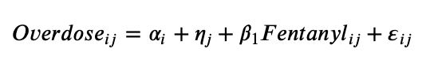
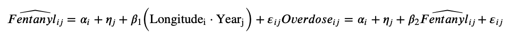

```{r setup, include=FALSE}
knitr::opts_chunk$set(echo = FALSE)

library(tidyverse)
library(knitr)

```

### 1.  

More information on this project can be found on my Github repository.^[[Github repository](https://github.com/alicrump/Fentanyl_Replication_Project)]

### 2.

```{r}
poison_multiple <- read_csv("nflis_dataverse/drugpoisonings_multiplecausesofdeath_stateyear_19992017pop.csv", col_types = cols(State = col_character(),
   Year = col_double(),
   Deaths = col_double(),
   Population = col_double(),
   `Crude Rate` = col_double(),
   `Age Adjusted Rate` = col_double()
 ))
poison_underlying <- read_csv("nflis_dataverse/drugpoisonings_underlyingcauseofdeath_stateyear_19992017pop.csv", col_types = cols(
   State = col_character(),
   Year = col_double(),
   Deaths = col_double(),
   Population = col_double(),
   `Crude Rate` = col_character(),
   `Age Adjusted Rate` = col_character()
 ))
 
 fent2017nflis <- read_csv("nflis_dataverse/fent2017nflis.csv",col_types = cols(
   .default = col_double(),
   State = col_character()
 ))
```

```{r}
FOIA01_05 <- read_delim("nflis_dataverse/FOIA_ItemLevelData_2001_2005.txt", delim = ",", col_types = cols(
   .default = col_logical(),
   State = col_character(),
   NFLISID = col_double(),
   AnalysisID = col_double(),
   SubmitDate = col_character(),
   Color = col_character(),
   Form = col_character(),
   Quantity = col_double(),
   Units = col_character(),
   Subst1 = col_character(),
   Subst2 = col_character(),
   Subst3 = col_character(),
   Subst4 = col_character(),
   Subst5 = col_character(),
   Subst6 = col_character(),
   Subst7 = col_character(),
   Subst8 = col_character(),
   `PACKAGING/MARKINGS` = col_character(),
   `How Acquired` = col_character(),
   Purity = col_character(),
   Origin = col_character(),
   Manufacturer = col_character()
 ))
```

```{r}
FOIA06_10 <- read_delim("nflis_dataverse/FOIA_ItemLevelData_20062010.txt", delim = ",", col_names = c("state", "nflis_id","analysis_id","submit_date","how_acquired","color","form","quantity","units","subst1","subst2","subst3","subst4","subst5","subst6","subst7","subst8","purity","origin","manufacturer","packaging"), col_types = 
                          cols(.default = col_logical(),
   state = col_character(),
   nflis_id = col_double(),
   analysis_id = col_double(),
   submit_date = col_character(),
   color = col_character(),
   form = col_character(),
   quantity = col_double(),
   units = col_character(),
   subst1 = col_character(),
   subst2 = col_character(),
   subst3 = col_character(),
   subst4 = col_character(),
   subst5 = col_character(),
   subst6 = col_character(),
   subst7 = col_character(),
   subst8 = col_character(),
   packaging = col_character(),
   how_acquired = col_character(),
   purity = col_character(),
   origin = col_character(),
   manufacturer = col_character()
 ))
```


```{r}
FOIA11_16 <- read_delim("nflis_dataverse/FOIA_ItemLevelData_20112016.txt", delim = ",", col_names = c("state", "nflis_id","analysis_id","submit_date","how_acquired","color","form","quantity","units","subst1","subst2","subst3","subst4","subst5","subst6","subst7","subst8","purity","origin","manufacturer","packaging"), col_types = cols(.default = col_logical(),
   state = col_character(),
   nflis_id = col_double(),
   analysis_id = col_double(),
   submit_date = col_character(),
   color = col_character(),
   form = col_character(),
   quantity = col_double(),
   units = col_character(),
   subst1 = col_character(),
   subst2 = col_character(),
   subst3 = col_character(),
   subst4 = col_character(),
   subst5 = col_character(),
   subst6 = col_character(),
   subst7 = col_character(),
   subst8 = col_character(),
   packaging = col_character(),
   how_acquired = col_character(),
   purity = col_character(),
   origin = col_character(),
   manufacturer = col_character()
 ))
```

```{r}
FOIA11_16_State <- read_delim("nflis_dataverse/FOIA_StateLevelData_20112016.txt", delim = ",", col_types = cols(
   State = col_character(),
   CaseReceived_Year = col_double(),
   CaseReceived_Month = col_double(),
   CountOfReportedResult = col_double(),
   Subst1 = col_character(),
   Subst2 = col_character(),
   Subst3 = col_character(),
   Subst4 = col_character(),
   Subst5 = col_character(),
   Subst6 = col_character(),
   Subst7 = col_character(),
   Subst8 = col_character(),
   SumOfReportedQuantity = col_double(),
   Units = col_character(),
   `How Acquired` = col_character(),
   Color = col_character(),
   Form = col_character(),
   AveragePurity = col_double()
 ))
```


```{r}
heroin <- read_csv("nflis_dataverse/heroin2017nflis.csv", col_types = cols(
 State = col_character(),
 Heroin = col_double(),
 Year = col_double()
))

latlon <- read_csv("nflis_dataverse/latlon.csv", col_types = cols(
 State = col_character(),
 Latitude = col_double(),
 Longitude = col_double()
))

overdose <- read_csv("nflis_dataverse/rx_od_state_0616.csv", col_types = cols(
 State = col_character(),
 Year = col_double(),
 Rate = col_double(),
 Age.Adjusted.Rate = col_double()
))

state_overdose <- read_csv("nflis_dataverse/state_od_19992016_pop.csv", col_types =
                             cols(
 State = col_character(),
 Year = col_double(),
 Deaths = col_double(),
 Population = col_double(),
 `Crude Rate` = col_double(),
 `Age Adjusted Rate` = col_double()
))
```


### 3.  
See References.

### 4.  

This paper explores fentanyl seizures and deaths in the United States from 2011-2017, namely the increases of both. Zoorob uses two models; Model 1 shows that fentanyl exposure has a positive association with mortality rates, and Model 2 tries to estimate the causal effect of fentanyl exposure on mortality rates. 

Zoorob runs a least squares regression for the first model. The model predicts overdose mortality as a function of fentanyl exposure. Fentanyl exposure takes into account the state, year, the natural logarithm of the number of test results containing fentanyl (in that state and year), and an error term. The standard errors are two-way clustered by state and year and includes population weights (@Paper). 



The second model uses a two-stage least squares regression:



Findings in the paper show that much of the variation in the increased overdose mortality is explained by fentanyl exposure, and that fentanyl deaths are highly correlated with geography, as the epicenter of the overdose crisis has shifted towards the eastern U.S. They also found that longitude is better able to explain levels of overdose mortality over time. States east of the Mississippi River tend to have greater fentanyl exposure and sharper increases in overdose deaths than states west of the Mississippi River (@Paper). Zoorob also uses both models to estimate the number or overdose deaths attributable to fentanyl and claims that they are broadly consistent with official mortality statistics. For my replication paper I am going to run the same statistical analyses and compare the results.

### 5.  
##### Appendix  

### References 
@Replication, 
@Paper,
@King,
@knitr2015,
@knitr2014