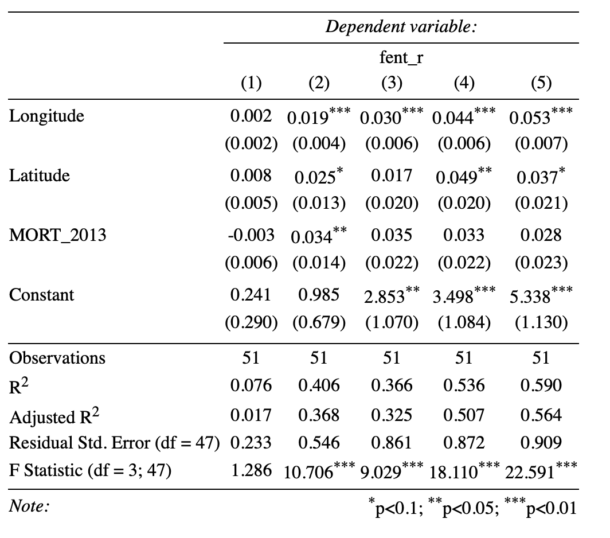

```{r setup, include=FALSE}
knitr::opts_chunk$set(echo = FALSE)

library(tidyverse)
library(knitr)
library(lubridate)
library(stargazer)
library(janitor)
```

### 1.  

More information on this project can be found on my Github repository.^[[Github repository](https://github.com/alicrump/Fentanyl_Replication_Project)]

### 2.

```{r}
poison_multiple <- read_csv("nflis_dataverse/drugpoisonings_multiplecausesofdeath_stateyear_19992017pop.csv", col_types = cols(State = col_character(),
   Year = col_double(),
   Deaths = col_double(),
   Population = col_double(),
   `Crude Rate` = col_double(),
   `Age Adjusted Rate` = col_double()
 )) %>% 
   clean_names()
poison_underlying <- read_csv("nflis_dataverse/drugpoisonings_underlyingcauseofdeath_stateyear_19992017pop.csv", col_types = cols(
   State = col_character(),
   Year = col_double(),
   Deaths = col_double(),
   Population = col_double(),
   `Crude Rate` = col_character(),
   `Age Adjusted Rate` = col_character()
 )) %>% 
   clean_names()
 
 fent2017nflis <- read_csv("nflis_dataverse/fent2017nflis.csv",col_types = cols(
   .default = col_double(),
   State = col_character()
 )) %>% 
    clean_names()
```

```{r}
FOIA01_05 <- read_delim("nflis_dataverse/FOIA_ItemLevelData_2001_2005.txt", delim = ",", col_types = cols(
   .default = col_logical(),
   State = col_character(),
   NFLISID = col_double(),
   AnalysisID = col_double(),
   SubmitDate = col_character(),
   Color = col_character(),
   Form = col_character(),
   Quantity = col_double(),
   Units = col_character(),
   Subst1 = col_character(),
   Subst2 = col_character(),
   Subst3 = col_character(),
   Subst4 = col_character(),
   Subst5 = col_character(),
   Subst6 = col_character(),
   Subst7 = col_character(),
   Subst8 = col_character(),
   `PACKAGING/MARKINGS` = col_character(),
   `How Acquired` = col_character(),
   Purity = col_character(),
   Origin = col_character(),
   Manufacturer = col_character()
 )) %>% 
   clean_names()
```

```{r}
FOIA06_10 <- read_delim("nflis_dataverse/FOIA_ItemLevelData_20062010.txt", delim = ",", col_names = c("state", "nflis_id","analysis_id","submit_date","how_acquired","color","form","quantity","units","subst1","subst2","subst3","subst4","subst5","subst6","subst7","subst8","purity","origin","manufacturer","packaging"), col_types = 
                          cols(.default = col_logical(),
   state = col_character(),
   nflis_id = col_double(),
   analysis_id = col_double(),
   submit_date = col_character(),
   color = col_character(),
   form = col_character(),
   quantity = col_double(),
   units = col_character(),
   subst1 = col_character(),
   subst2 = col_character(),
   subst3 = col_character(),
   subst4 = col_character(),
   subst5 = col_character(),
   subst6 = col_character(),
   subst7 = col_character(),
   subst8 = col_character(),
   packaging = col_character(),
   how_acquired = col_character(),
   purity = col_character(),
   origin = col_character(),
   manufacturer = col_character()
 )) %>% 
   clean_names()
```


```{r}
FOIA11_16 <- read_delim("nflis_dataverse/FOIA_ItemLevelData_20112016.txt", delim = ",", col_names = c("state", "nflis_id","analysis_id","submit_date","how_acquired","color","form","quantity","units","subst1","subst2","subst3","subst4","subst5","subst6","subst7","subst8","purity","origin","manufacturer","packaging"), col_types = cols(.default = col_logical(),
   state = col_character(),
   nflis_id = col_double(),
   analysis_id = col_double(),
   submit_date = col_character(),
   color = col_character(),
   form = col_character(),
   quantity = col_double(),
   units = col_character(),
   subst1 = col_character(),
   subst2 = col_character(),
   subst3 = col_character(),
   subst4 = col_character(),
   subst5 = col_character(),
   subst6 = col_character(),
   subst7 = col_character(),
   subst8 = col_character(),
   packaging = col_character(),
   how_acquired = col_character(),
   purity = col_character(),
   origin = col_character(),
   manufacturer = col_character()
 )) %>% 
   clean_names()
```

```{r}
FOIA11_16_State <- read_delim("nflis_dataverse/FOIA_StateLevelData_20112016.txt", delim = ",", col_types = cols(
   State = col_character(),
   CaseReceived_Year = col_double(),
   CaseReceived_Month = col_double(),
   CountOfReportedResult = col_double(),
   Subst1 = col_character(),
   Subst2 = col_character(),
   Subst3 = col_character(),
   Subst4 = col_character(),
   Subst5 = col_character(),
   Subst6 = col_character(),
   Subst7 = col_character(),
   Subst8 = col_character(),
   SumOfReportedQuantity = col_double(),
   Units = col_character(),
   `How Acquired` = col_character(),
   Color = col_character(),
   Form = col_character(),
   AveragePurity = col_double()
 )) %>% 
   clean_names()
```


```{r}
heroin <- read_csv("nflis_dataverse/heroin2017nflis.csv", col_types = cols(
 State = col_character(),
 Heroin = col_double(),
 Year = col_double()
)) %>% clean_names()

latlon <- read_csv("nflis_dataverse/latlon.csv", col_types = cols(
 State = col_character(),
 Latitude = col_double(),
 Longitude = col_double()
)) %>% clean_names()

overdose <- read_csv("nflis_dataverse/rx_od_state_0616.csv", col_types = cols(
 State = col_character(),
 Year = col_double(),
 Rate = col_double(),
 Age.Adjusted.Rate = col_double()
)) %>% clean_names()

state_overdose <- read_csv("nflis_dataverse/state_od_19992016_pop.csv", col_types =
                             cols(
 State = col_character(),
 Year = col_double(),
 Deaths = col_double(),
 Population = col_double(),
 `Crude Rate` = col_double(),
 `Age Adjusted Rate` = col_double()
)) %>% clean_names()
```

There are so many different data files and I'm still sorting through them and trying to figure out how they are different and what each of them are measuring. That being said, I just made a graphic from the most straightforward data set I could find.

```{r}
east <- c("Wisconsin","Illinois","Indiana","Kentucky","Tennessee","Mississippi","Michigan","Ohio","West Virginia","North Carolina","Alabama","Pennsylvania","Virginia","South Carolina","Georgia","Vermont","New York","New Jersey","Maryland","District of Columbia","Florida","New Hampshire","Massachussetts","Connecticut","Delaware","Maine","Rhode Island")

overdose %>% 
  filter(!(state %in% c("Alaska","Hawaii"))) %>% 
  mutate(coast = ifelse(state %in% east, "East","West")) %>% 
  group_by(year, coast) %>% 
  mutate(avg = mean(age_adjusted_rate)) %>% 
  drop_na() %>% 
  ggplot(aes(x = year, y = avg, color = coast)) +
  geom_point() +
  theme_bw() +
  labs(x = "Year", y = "Rate / 100k", title = "Fentanyl Surge 2006-2016", subtitle = "States East of Mississippi Seeing Larger Increases in Overdose Death Rates on Average", caption = "Data from https://doi.org/10.7910/DVN/8FWVFK as part of a replication
  project on 'Fentanyl shock: The changing geography of overdose in the
  United States' by Michael Zoorob.", color = "Coast")
```


### 3.  
See References.

### 4.  

This paper explores fentanyl seizures and deaths in the United States from 2011-2017, namely the increases of both. Zoorob uses two models; Model 1 shows that fentanyl exposure has a positive association with mortality rates, and Model 2 tries to estimate the causal effect of fentanyl exposure on mortality rates. 

Zoorob runs a least squares regression for the first model. The model predicts overdose mortality as a function of fentanyl exposure. Fentanyl exposure takes into account the state, year, the natural logarithm of the number of test results containing fentanyl (in that state and year), and an error term. The standard errors are two-way clustered by state and year and includes population weights (@Paper). 


The second model uses a two-stage least squares regression:


Findings in the paper show that much of the variation in the increased overdose mortality is explained by fentanyl exposure, and that fentanyl deaths are highly correlated with geography, as the epicenter of the overdose crisis has shifted towards the eastern U.S. They also found that longitude is better able to explain levels of overdose mortality over time. States east of the Mississippi River tend to have greater fentanyl exposure and sharper increases in overdose deaths than states west of the Mississippi River (@Paper). Zoorob also uses both models to estimate the number or overdose deaths attributable to fentanyl and claims that they are broadly consistent with official mortality statistics. For my replication paper I am going to run the same statistical analyses and compare the results.

### 5.  
##### Appendix  

I can't do this all in 2 days just after the midterm. There are way too many sources of data and way too many creations of variables in several different data sets to keep track of. I have spent the entire day sorting through this code and trying to do the same as they did and will not finish this in time. This is the code I have so far- I did something wrong because propfent is 1 for every single row. I do not know what the error is and it will take be several days more to make sense of their variables.

```{r}
# d = unique(c(
#   unique(FOIA11_16$subst1)[grep("fentanyl|Fentanyl|FENTANYL",
#                             unique(FOIA11_16$subst1))],
#     unique(FOIA11_16$subst2)[grep("fentanyl|Fentanyl|FENTANYL",
#                              unique(FOIA11_16$subst1))], "U-47700"
#     ))
# 
# t1 <- FOIA11_16 %>% 
#   mutate(fent = as.numeric((rowSums(`dim<-`(as.matrix(FOIA11_16) %in% d, dim(FOIA11_16))) >= 1))) %>% 
#   mutate(date = mdy(submit_date)) %>% 
#   mutate(year = year(date))
# 
# fentstateyear <- t1 %>% 
#   group_by(state, year) %>% 
#   summarize(any = n(),
#             propfent = mean(fent),
#             sumfent = sum(fent))
```

```{r}
# t1o <- FOIA11_16_State %>% 
#   mutate(fent = as.numeric((rowSums(`dim<-`(as.matrix(FOIA11_16_State) %in% d, dim(FOIA11_16_State))) >= 1))) %>% 
#   mutate(year = as.numeric(CaseReceived_Year))
# 
# fentstateyear2 <- t1o %>% 
#   group_by(State, year) %>% 
#   summarize(any = sum(CountOfReportedResult),
#             propfent = mean(fent*CountOfReportedResult),
#             sumfent = sum(fent*CountOfReportedResult)) %>% 
#   mutate(state = State)
# 
# presod <- overdose %>% 
#   mutate(ST = state.abb[match(State,state.name)]) %>% 
#   filter(State != "DC") %>% 
#   mutate(Age.Adjusted.Rate = NULL)
# 
# fentstateyear_m <- rbind(fentstateyear, fentstateyear2)
# fentstateyear_m <- fentstateyear_m %>% 
#   group_by(state, year) %>% 
#   summarize(sumfent = sum(sumfent),
#             any = sum(any)) %>% 
#   mutate(propfent = sumfent/any)
# 
# fent2017nflis <- fent2017nflis %>% 
#    mutate(ST = state.abb[match(State,state.name)]) %>% 
#    mutate(year = 2017)
#    
# fent2017nflis[is.na(fent2017nflis$ST), "ST"] = "DC"
# 
# db <- fent2017nflis[,c("ST","year","allfent")]
# colnames(db[3]) = "sumfent"
# db$any = NA
# db$propfent = NA
# 
# fentstateyear_m <- rbind(data.frame(fentstateyear_m, db))
# 
# presod_f <- fentstateyear_m %>% 
#    filter(State != "PR") %>% 
#    mutate(logfent = log(sumfent + 1))
# 
# poison_multiple <- poison_multiple %>% 
#    mutate(ST = state.abb[match(State,state.name)])
# poison_multiple[is.na(poison_multiple$ST), "ST"] = "DC"
# 
# presod_f <- merge(presod_f, poison_multiple, by.x = c("State","year"), by.y = c("ST","year"))
# 
# presod_f <- merge(presod_f, latlon) %>% 
#    mutate(fentcapita = (sumfent/(population*100000))) %>% 
#    mutate(fent_r = log(fentcapita + 1))
# 
# lagdv <- presod_f[year == 2013, c("State","Age.Adjusted.Rate")]
# colnames(lagdv) = c("State","MORT_2011")
# presod_f <- merge(presod_f, lagdv, all.x = TRUE, all.y = FALSE)
```

```{r}
d <- unique(c(
  unique(FOIA11_16$subst1)[grep("fentanyl|Fentanyl|FENTANYL",
                            unique(FOIA11_16$subst1))],
    unique(FOIA11_16$subst2)[grep("fentanyl|Fentanyl|FENTANYL",
                             unique(FOIA11_16$subst2))], "U-47700"
    ))
h_string <- c("Heroin", "heroin", "HEROIN")
d_h <- c(d, "Heroin", "heroin", "HEROIN")


FOIA11_16$fent <- as.numeric(rowSums(`dim<-`(as.matrix(FOIA11_16) %in% d, dim(FOIA11_16))) >= 1)
FOIA11_16$heroin <- as.numeric(rowSums(`dim<-`(as.matrix(FOIA11_16) %in% c("Heroin"), dim(FOIA11_16))) >= 1)
FOIA11_16$date <- mdy(FOIA11_16$submit_date)
FOIA11_16$year <- year(FOIA11_16$date)

fentstateyear <- FOIA11_16 %>%
   group_by(state, year) %>%
   summarize(any = n(),
             propfent = mean(fent),
             sumfent = sum(fent),
             sumheroin = sum(heroin))

# other states
FOIA11_16_State$fent <- as.numeric(rowSums(`dim<-`(as.matrix(FOIA11_16_State) %in% d, dim(FOIA11_16_State))) >= 1)
FOIA11_16_State$heroin <- as.numeric(rowSums(`dim<-`(as.matrix(FOIA11_16_State) %in% c("Heroin"), dim(FOIA11_16_State))) >= 1)
# FOIA11_16_State$date = mdy(FOIA11_16_State$SubmitD1ate)
FOIA11_16_State$year <- as.numeric(FOIA11_16_State$case_received_year)

fentstateyear2 <- FOIA11_16_State %>%
   group_by(state, year) %>%
   summarize(any = sum(count_of_reported_result),
             propfent = mean(fent*count_of_reported_result),
             sumfent = sum(fent*count_of_reported_result),
             sumheroin = sum(heroin*count_of_reported_result)
                                                )

overdose$ST <- state.abb[match(overdose$state,state.name)]
overdose[is.na(overdose$ST), "ST"] <- "DC"
overdose$age_adjusted_rate <- NULL


# fentyear
fentyear <- fentstateyear %>%
   group_by(year) %>%
   summarize(sumfent = sum(sumfent))

### incorporate fentanyl from 2017
fent2017nflis$ST <- state.abb[match(fent2017nflis$state,state.name)]
fent2017nflis$year <- 2017
fent2017nflis[is.na(fent2017nflis$ST), "ST"] <- "DC"


fentyear <- rbind(fentyear, c(2017, sum(fent2017nflis$allfent)))

### incorporate heroin from 2017

heroin$ST <- state.abb[match(heroin$state,state.name)]
heroin$year <- 2017
heroin[is.na(heroin$ST), "ST"] <- "DC"


## geo facet - fent count year

fentstateyear_m <- rbind(fentstateyear, fentstateyear2)
fentstateyear_m <- fentstateyear_m %>%
   group_by(state, year) %>%
   summarize(sumfent = sum(sumfent),
             any = sum(any), 
             sumheroin=sum(sumheroin))

fentstateyear_m$propfent <- fentstateyear_m$sumfent/fentstateyear_m$any

# get 2017
d17b <- fent2017nflis[,c("ST", "year", "allfent")]
colnames(d17b)[3] <- "sumfent"
d17b$any <- NA
d17b <- merge(d17b, heroin[,2:4])
colnames(d17b)[1] <- "state"
colnames(d17b)[5] <- "sumheroin"
d17b$propfent <- NA

### GETTING AN ERROR HERE : NUMBERS OF COLUMNS OF ARGUMENTS DO NOT MATCH
fentstateyear_m <- rbind(data.frame(fentstateyear_m), d17b)
##

####################### clean up; end drug seizures processing
rm(FOIA11_16, FOIA11_16_State)
presod_f <- fentstateyear_m[fentstateyear_m$state != "PR",]
presod_f$logfent <- log(presod_f$sumfent+1)

##

############ merge  od with seizures
################## GET STATE YEAR POP
poison_multiple$ST <- state.abb[match(poison_multiple$state,state.name)]
poison_multiple[is.na(poison_multiple$ST), "ST"] <- "DC"

presod_f <- merge(presod_f, poison_multiple, by.x=c("state", "year"), by.y = c("ST", "year"))
rm(poison_multiple)
colnames(presod_f)[1]<-"ST"
colnames(presod_f)[8] <- "state"

########## GET LAT LON
presod_f <- merge(presod_f, latlon)


presod_f$fentcapita <- presod_f$sumfent/presod_f$population*100000
# take log of seizures per capita
presod_f$fent_r <- log(presod_f$fentcapita+1)
presod_f$perfent <- presod_f$propfent*100


#### create lagged dvs for mortality rate in 2013 and mortality rate in 2011 
lagdv <- presod_f[presod_f$year==2013, c("state", "age_adjusted_rate")]
colnames(lagdv) <- c("state", "mort_2013")
presod_f <- merge(presod_f, lagdv)

lagdv <- presod_f[presod_f$year==2011, c("state", "age_adjusted_rate")]
colnames(lagdv) <- c("state", "mort_2011")
presod_f <- merge(presod_f, lagdv, all.x = TRUE, all.y = FALSE)

# # create first difference style variables
# presod_f$MORT_DIFF_11 = presod_f$Age.Adjusted.Rate - presod_f$MORT_2011
# # robustness/placebo
# presod_f$MORT_DIFF_13 = presod_f$Age.Adjusted.Rate - presod_f$MORT_2013
```


```{r, results='asis'}
stargazer(lm(fent_r~longitude+latitude+mort_2013, data=presod_f[presod_f$year==2013,]),  
          lm(fent_r~longitude+latitude+mort_2013, data=presod_f[presod_f$year==2014,]),  
          lm(fent_r~longitude+latitude+mort_2013, data=presod_f[presod_f$year==2015,]),  
          lm(fent_r~longitude+latitude+mort_2013, data=presod_f[presod_f$year==2016,]),  
          lm(fent_r~longitude+latitude+mort_2013, data=presod_f[presod_f$year==2017,]), type = 'latex') 
```


This is the code I am trying to run to make a table:


stargazer(  
          lm(fent_r~Longitude+Latitude+MORT_2013, data=presod_f[presod_f$Year==2013,]),  
          lm(fent_r~Longitude+Latitude+MORT_2013, data=presod_f[presod_f$Year==2014,]),  
          lm(fent_r~Longitude+Latitude+MORT_2013, data=presod_f[presod_f$Year==2015,]),  
          lm(fent_r~Longitude+Latitude+MORT_2013, data=presod_f[presod_f$Year==2016,]),  
          lm(fent_r~Longitude+Latitude+MORT_2013, data=presod_f[presod_f$Year==2017,]))  

To run this I need to read in several data sets, make several variables in each data set, then merge the data sets together into presod_f. The fent_r, longitude/latitude, MORT_2013, and year variables are all in different data sets. Once I am able to merge them all I will run this code.

This is the table from the paper that I am trying to replicate:




### References 
@Replication, 
@Paper,
@King,
@knitr2015,
@knitr2014