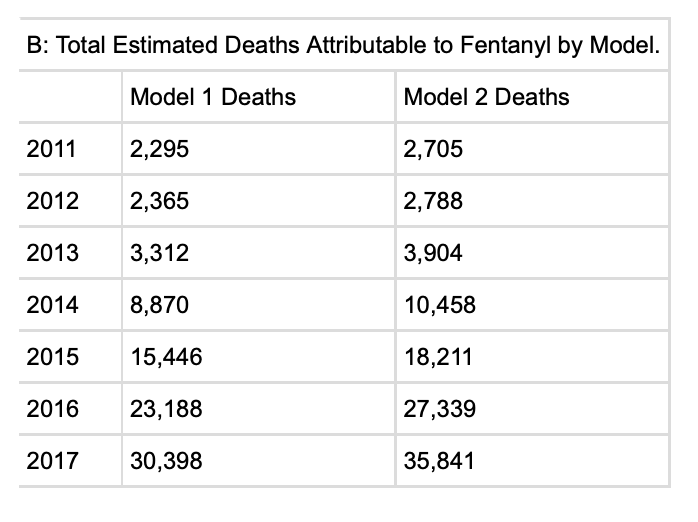

```{r setup, include=FALSE}
knitr::opts_chunk$set(echo = FALSE)

library(tidyverse)
library(knitr)
library(lubridate)
library(stargazer)
library(janitor)
library(geofacet)
library(lfe)
library(rstanarm)
```

### Abstract

Zoorob (2019) shows that geography and fentanyl exposure explain much of the variation in increased overdose mortality rates between 2011 and 2017. This paper succeeds in replicating all of the figures and tables in Zoorob’s research with the exception of Table 2B, the total estimated deaths attributable to fentanyl by each model. The estimates from table in the original publication more closely match official mortality statistics than the ones replicated in this paper. In addition to replicating Zoorob’s work, the extension of this paper aims to improve the two-stage least squares regression analysis by performing a *TBD* alternative strategy to analyze the instrumental variables. In my analysis I find *X*, which matters because *Y*.

### Introduction

Zoorob uses two models; Model 1 shows that fentanyl exposure has a positive association with mortality rates, and Model 2 tries to estimate the causal effect of fentanyl exposure on mortality rates. Zoorob runs a least squares regression for the first model. The model predicts overdose mortality as a function of fentanyl exposure. Fentanyl exposure takes into account the state, year, an error term, and the natural logarithm of the number of test results containing fentanyl:

$Fentanyl_{ij} = \log{(\frac{S_{ij}}{P_{ij}} + 1)}$

Model 1 below is an ordinary least squares equation where $\alpha_{i}$ is state $i$ and $\eta_{j}$ is year $j$ The standard errors are two-way clustered by state and year and includes population weights (@Paper). 

$Overdose_{ij} = \alpha_{i} + \eta_{j} + \beta_{1}Fentanyl_{ij} + \epsilon_{ij}$

The second model uses a two-stage least squares regression:

$\widehat{Fentanyl_{ij}} = \alpha_{i} + \eta_{j} + \beta_{1}(Longitude_{i}\cdot Year_{j}) + \epsilon_{ij}Overdose_{ij} = \alpha_{i} + \eta_{j} + \beta_{2}\widehat{Fentanyl_{ij}} + \epsilon_{ij}$

Findings in the paper show that much of the variation in the increased overdose mortality is explained by fentanyl exposure, and that fentanyl deaths are highly correlated with geography, as the epicenter of the overdose crisis has shifted towards the eastern U.S. They also found that longitude is better able to explain levels of overdose mortality over time. States east of the Mississippi River tend to have greater fentanyl exposure and sharper increases in overdose deaths than states west of the Mississippi River (@Paper). Zoorob also uses both models to estimate the number or overdose deaths attributable to fentanyl and claims that they are broadly consistent with official mortality statistics.  

Zoorob obtained the data used for his analysis through a Freedom of Information Act request. The data consist of state test results for drug seizures between 2011 and 2016, which he filters for test results containing fentanyl. Zoorob also uses age-adjusted mortality data from the National Center for Health Statistics. All the data used contain state and year information, and he uses state-annual populatons to calcaulte mortality rates relative to a state's population in a particular year. The data and code that Zoorob used in his paper is available on the [Harvard Dataverse](https://doi.org/10.7910/DVN/8FWVFK). To conduct my replication, I used R. More information on this project can be found on my Github repository.^[[Github repository](https://github.com/alicrump/Fentanyl_Replication_Project)]  

**What did I do?**

**What did I find?**

### Literature Review

**relevant literature in the paper**  

The number of drug overdose deaths in the United states has rapidly increased since 2014. However, the opiod epidemic did not affect all regions of the U.S. equally; according to the CDC, almost all states west of the Mississippi River did not see an increase while those to the west did. While Dasgupta et. al argue social and economic factors play a role in one's susceptibility to opiod addiction and overdose, Zoorob claims that the geographical patterns point to drug supply also playing a primary role in the epidemic.
 
**relevant literature since the paper published**  

Research by Barocas et al. on the effect of opiod use among patients with endocarditis cites Zoorob's paper and also finds a decreased risk of overdose associated with the West and South compared to the Northeast (@endocarditis).
Although in 2018, drug overdose deaths actually decreased by 4.6% from 2017 in the United States, fentanyl deaths continued to rise (@CDC)(@NYT). (Still looking for literature on this)


```{r read data 1, cache=TRUE}
poison_multiple <- read_csv("data/drugpoisonings_multiplecausesofdeath_stateyear_19992017pop.csv", 
                            col_types = cols(State = col_character(),
                                             Year = col_double(),
                                             Deaths = col_double(),
                                             Population = col_double(),
                                             `Crude Rate` = col_double(),
                                             `Age Adjusted Rate` = col_double())) %>% 
                   clean_names()
write_rds(poison_multiple, "data/poison_multiple.rds")
```


```{r read data 2, eval=FALSE}
# they don't use this data

poison_underlying <- read_csv("data/drugpoisonings_underlyingcauseofdeath_stateyear_19992017pop.csv", 
                              col_types = cols(State = col_character(),
                                               Year = col_double(),
                                               Deaths = col_double(),
                                               Population = col_double(),
                                               `Crude Rate` = col_character(),
                                               `Age Adjusted Rate` = col_character())) %>% 
                     clean_names()
```


```{r read data 3, cache=TRUE}
fent2017nflis <- read_csv("data/fent2017nflis.csv",
                          col_types = cols(.default = col_double(),
                                            State = col_character())) %>% 
                 clean_names()
write_rds(fent2017nflis, "data/fent2017nflis.rds")
```

```{r read data 4, eval=FALSE}
# they don't use this data

FOIA01_05 <- read_delim("data/FOIA_ItemLevelData_2001_2005.txt", 
                        delim = ",", 
                        col_types = cols(.default = col_logical(),
                                          State = col_character(),
                                          NFLISID = col_double(),
                                          AnalysisID = col_double(),
                                          SubmitDate = col_character(),
                                          Color = col_character(),
                                          Form = col_character(),
                                          Quantity = col_double(),
                                          Units = col_character(),
                                          Subst1 = col_character(),
                                          Subst2 = col_character(),
                                          Subst3 = col_character(),
                                          Subst4 = col_character(),
                                          Subst5 = col_character(),
                                          Subst6 = col_character(),
                                          Subst7 = col_character(),
                                          Subst8 = col_character(),
                                          `PACKAGING/MARKINGS` = col_character(),
                                          `How Acquired` = col_character(),
                                          Purity = col_character(),
                                          Origin = col_character(),
                                          Manufacturer = col_character())) %>% 
              clean_names()
```

```{r read data 5, eval=FALSE}
# they don't use this data
FOIA06_10 <- read_delim("data/FOIA_ItemLevelData_20062010.txt",
                        delim = ",", 
                        col_names = c("state","nflis_id","analysis_id",
                                      "submit_date","how_acquired","color",
                                      "form","quantity","units","subst1",
                                      "subst2","subst3","subst4","subst5",
                                      "subst6","subst7","subst8","purity",
                                      "origin","manufacturer","packaging"), 
                        col_types = cols(.default = col_logical(),
                                          state = col_character(),
                                          nflis_id = col_double(),
                                          analysis_id = col_double(),
                                          submit_date = col_character(),
                                          color = col_character(),
                                          form = col_character(),
                                          quantity = col_double(),
                                          units = col_character(),
                                          subst1 = col_character(),
                                          subst2 = col_character(),
                                          subst3 = col_character(),
                                          subst4 = col_character(),
                                          subst5 = col_character(),
                                          subst6 = col_character(),
                                          subst7 = col_character(),
                                          subst8 = col_character(),
                                          packaging = col_character(),
                                          how_acquired = col_character(),
                                          purity = col_character(),
                                          origin = col_character(),
                                          manufacturer = col_character())) %>% 
                        clean_names()
```


```{r read data 6, cache=TRUE}
FOIA11_16 <- read_delim("data/FOIA_ItemLevelData_20112016.txt",
                        delim = ",",
                        col_names = c("state","nflis_id","analysis_id",
                                      "submit_date","how_acquired","color",
                                      "form","quantity","units","subst1",
                                      "subst2","subst3","subst4","subst5",
                                      "subst6","subst7","subst8","purity",
                                      "origin","manufacturer","packaging"), 
                        col_types = cols(.default = col_logical(),
                                          state = col_character(),
                                          nflis_id = col_double(),
                                          analysis_id = col_double(),
                                          submit_date = col_character(),
                                          color = col_character(),
                                          form = col_character(),
                                          quantity = col_double(),
                                          units = col_character(),
                                          subst1 = col_character(),
                                          subst2 = col_character(),
                                          subst3 = col_character(),
                                          subst4 = col_character(),
                                          subst5 = col_character(),
                                          subst6 = col_character(),
                                          subst7 = col_character(),
                                          subst8 = col_character(),
                                          packaging = col_character(),
                                          how_acquired = col_character(),
                                          purity = col_character(),
                                          origin = col_character(),
                                          manufacturer = col_character())) %>% 
                       clean_names()
write_rds(FOIA11_16, "data/FOIA11_16.rds")
```

```{r read data 7, cache=TRUE}
FOIA11_16_State <- read_delim("data/FOIA_StateLevelData_20112016.txt",
                              delim = ",", 
                              col_types = cols(State = col_character(),
                                               CaseReceived_Year = col_double(),
                                               CaseReceived_Month = col_double(),
                                               CountOfReportedResult = col_double(),
                                               Subst1 = col_character(),
                                               Subst2 = col_character(),
                                               Subst3 = col_character(),
                                               Subst4 = col_character(),
                                               Subst5 = col_character(),
                                               Subst6 = col_character(),
                                               Subst7 = col_character(),
                                               Subst8 = col_character(),
                                               SumOfReportedQuantity = col_double(),
                                               Units = col_character(),
                                               `How Acquired` = col_character(),
                                               Color = col_character(),
                                               Form = col_character(),
                                               AveragePurity = col_double())) %>% 
                   clean_names()
write_rds(FOIA11_16_State, "data/FOIA11_16_State.rds")
```


```{r read data 8, cache=TRUE}
heroin <- read_csv("data/heroin2017nflis.csv", 
                   col_types = cols(State = col_character(),
                                    Heroin = col_double(),
                                    Year = col_double())) %>% 
          clean_names()
write_rds(heroin, "data/heroin.rds")
```


```{r read data 9, cache=TRUE}
latlon <- read_csv("data/latlon.csv", 
                   col_types = cols(State = col_character(),
                                    Latitude = col_double(),
                                    Longitude = col_double())) %>%
          clean_names()
write_rds(latlon, "data/latlon.rds")
```


```{r read data 10, cache=TRUE}
overdose <- read_csv("data/rx_od_state_0616.csv", 
                     col_types = cols(State = col_character(),
                                      Year = col_double(),
                                      Rate = col_double(),
                                      Age.Adjusted.Rate = col_double())) %>%
            clean_names()
write_rds(overdose, "data/overdose.rds")
```


```{r read data 11, eval=FALSE}
# they dont use this data

state_overdose <- read_csv("data/state_od_19992016_pop.csv", 
                           col_types = cols(State = col_character(),
                                            Year = col_double(),
                                            Deaths = col_double(),
                                            Population = col_double(),
                                            `Crude Rate` = col_double(),
                                            `Age Adjusted Rate` = col_double())) %>%
                  clean_names()
```


```{r}
d = unique(c(
  unique(FOIA11_16$subst1)[grep("fentanyl|Fentanyl|FENTANYL",
                            unique(FOIA11_16$subst1))],
    unique(FOIA11_16$subst2)[grep("fentanyl|Fentanyl|FENTANYL",
                             unique(FOIA11_16$subst2))], "U-47700"
    ))
h_string = c("Heroin", "heroin", "HEROIN")
d_h = c(d, "Heroin", "heroin", "HEROIN")


FOIA11_16$fent = as.numeric(rowSums(`dim<-`(as.matrix(FOIA11_16) %in% d, dim(FOIA11_16))) >= 1)
FOIA11_16$heroin = as.numeric(rowSums(`dim<-`(as.matrix(FOIA11_16) %in% c("Heroin"), dim(FOIA11_16))) >= 1)
FOIA11_16$date = mdy(FOIA11_16$submit_date)
FOIA11_16$year = year(FOIA11_16$date)

fentstateyear = FOIA11_16 %>%
  group_by(state, year) %>%
  summarize(any = n(), propfent = mean(fent),
            sumfent = sum(fent),sumheroin = sum(heroin))

# other states
FOIA11_16_State$fent = as.numeric(rowSums(`dim<-`(as.matrix(FOIA11_16_State) %in% d, dim(FOIA11_16_State))) >= 1)
FOIA11_16_State$heroin = as.numeric(rowSums(`dim<-`(as.matrix(FOIA11_16_State) %in% c("Heroin"), dim(FOIA11_16_State))) >= 1)
#FOIA11_16_State$date = mdy(FOIA11_16_State$SubmitD1ate)
FOIA11_16_State$year = as.numeric(FOIA11_16_State$case_received_year)

fentstateyear2 = FOIA11_16_State %>% 
  group_by(state, year) %>% 
  summarize(any = sum(count_of_reported_result),
            propfent = mean(fent*count_of_reported_result),
            sumfent = sum(fent*count_of_reported_result),
            sumheroin = sum(heroin*count_of_reported_result))

overdose$ST = state.abb[match(overdose$state,state.name)]
overdose[is.na(overdose$ST), "ST"] = "DC"
overdose$age_adjusted_rate = NULL
```


```{r, include = FALSE, echo = FALSE}
############### PLOTS
############ FIGURE 1

# fentyear
fentyear = fentstateyear %>% 
  group_by(year) %>% 
  summarize(sumfent = sum(sumfent))

### incorporate fentanyl from 2017
fent2017nflis$ST = state.abb[match(fent2017nflis$state,state.name)]
fent2017nflis$year = 2017
fent2017nflis[is.na(fent2017nflis$ST), "ST"] = "DC"
#

fentyear = rbind(fentyear, c(2017, sum(fent2017nflis$allfent)))
ggplot(fentyear, aes(factor(year), sumfent/1000, fill="Black")) + 
  geom_col(fill="Black") + 
  xlab("") +
  ylab("Fentanyl Test Reports (Thousands) \n") + 
  geom_text(aes(label=sumfent),hjust=0.5, vjust=-0.5, size=6) +
  theme_classic() +  
  theme(legend.position="", axis.text=element_text(size=14), axis.title.y=element_text(size=14))
# ggsave("Figures/Appendix/FIGUREA1_fentseizures_years.png.png", width=12, height=8, units="in", dpi=300)


### incorporate heroin from 2017
heroin$ST = state.abb[match(heroin$state,state.name)]
heroin$year = 2017
heroin[is.na(heroin$ST), "ST"] = "DC"

############# END FIGURE 1
```


```{r}
## geo facet - fent count year

fentstateyear_m = rbind(fentstateyear, fentstateyear2)
fentstateyear_m = fentstateyear_m %>% group_by(state, year) %>% summarize(sumfent = sum(sumfent),
                                                            any = sum(any), sumheroin=sum(sumheroin))
fentstateyear_m$propfent = fentstateyear_m$sumfent/fentstateyear_m$any

###
# get 2017
d17b = fent2017nflis[,c("ST", "year", "allfent")]
colnames(d17b)[3] = "sumfent"
d17b$any = NA
d17b = merge(d17b, heroin[,2:4])
colnames(d17b)[1] = "state"
colnames(d17b)[5] = "sumheroin"
d17b$propfent = NA


fentstateyear_m = rbind(data.frame(fentstateyear_m), d17b)

####################### clean up; end drug seizures processing
presod_f = fentstateyear_m[fentstateyear_m$state != "PR",]
presod_f$logfent = log(presod_f$sumfent+1)

##

############ merge  od with seizures
################## GET state year POP
poison_multiple$ST = state.abb[match(poison_multiple$state,state.name)]
poison_multiple[is.na(poison_multiple$ST), "ST"] = "DC"

presod_f = merge(presod_f, poison_multiple, by.x=c("state", "year"), by.y = c("ST", "year"))
colnames(presod_f)[1]="ST"
colnames(presod_f)[8] = "state"

########## GET LAT LON
presod_f = merge(presod_f, latlon)

###########
presod_f$fentcapita = presod_f$sumfent/presod_f$population*100000
# take log of seizures per capita
presod_f$fent_r = log(presod_f$fentcapita+1)
presod_f$perfent = presod_f$propfent*100
#######

#### TGROUP
#presod_f$tgroup = as.numeric(presod_f$longitude >= -90)
presod_f$tgroup = as.numeric(presod_f$longitude>-89.978027)
presod_f$tg2 = "West of MS River"
presod_f[presod_f$tgroup==1, "tg2"] = "East of MS River"
####

#### create lagged dvs for mortality rate in 2013 and mortality rate in 2011 
lagdv = presod_f[presod_f$year==2013, c("state", "age_adjusted_rate")]
colnames(lagdv) = c("state", "MORT_2013")
presod_f = merge(presod_f, lagdv)

lagdv = presod_f[presod_f$year==2011, c("state", "age_adjusted_rate")]
colnames(lagdv) = c("state", "MORT_2011")
presod_f = merge(presod_f, lagdv, all.x=TRUE, all.y=FALSE)

# create first difference style variables
presod_f$MORT_DIFF_11 = presod_f$age_adjusted_rate - presod_f$MORT_2011
# robustness/placebo
presod_f$MORT_DIFF_13 = presod_f$age_adjusted_rate - presod_f$MORT_2013

# prop heroin & heroin per capita
presod_f$propheroin = presod_f$sumheroin/presod_f$any
presod_f$heroincapita = presod_f$sumheroin/presod_f$population*100000
presod_f$heroin_r = log(presod_f$heroincapita+1)
presod_f$perheroin = presod_f$propheroin*100
```

### Appendix  

```{r figure 1,fig.height=8, fig.width=12, dpi=300}
############################## FIGURE 2
ggplot(presod_f, aes(x=year, 100*fentcapita, fill=tgroup)) + 
  geom_col() + 
  xlab("") +
  ylab("Fentanyl/Analogues per 100k \n") + 
  facet_geo(~state, scales="fixed") +
  theme_bw() + 
  theme(legend.position = "", plot.title = element_text(size=28), axis.text = element_text(size=7)) +
  labs(caption = "Source: National Forensic Laboratory Information System (NFLIS)") +
  ggtitle("\n Drug Seizures with Fentanyl (2011-2017) \n") 
# ggsave("Figures/Figure2/figure2_fentcapita_17.png", width=12, height=8, units="in", dpi=300)
```


tables 2a 2b

```{r tables 2a 2b, echo=FALSE, include=FALSE}
### IV AND MARGINALS
minst1 = felm(age_adjusted_rate ~ 1 | ST+year | (fent_r~longitude:year) | ST+year, 
              data=presod_f, weights=presod_f$population)
presod_f$fenteffectiv = presod_f$fent_r*summary(minst1)$coefficients[1]

## first stage F
summary(minst1$stage1)$iv1fstat["F"]
##

minst2 = felm(age_adjusted_rate ~ fent_r | ST+year | 0 | ST+year, 
              data=presod_f, weights=presod_f$population)
presod_f$fenteffect = presod_f$fent_r*summary(minst2)$coefficients[1]
```

table 2
fentr = model 1 
fent_r(fit) = model2

```{r, results='asis'}
#################################### TABLE 2
stargazer(minst2, minst1, type = 'latex', header = FALSE)

# save coefs
ols_coef = summary(minst2)$coefficients[1]
iv_coef = summary(minst1)$coefficients[1]

### estimate deaths
estdeath = function(dat, year, beta=ols_coef) {
  sum(beta*(dat[dat[,"year"]==year, "fent_r"])*(dat[dat[,"year"]==year,"population"]/100000))
}

# marginal effects df
meff = data.frame(cbind(
  rbind(               mean(presod_f[presod_f$year==2011,"fenteffect"]),
                       mean(presod_f[presod_f$year==2012,"fenteffect"]),
                       mean(presod_f[presod_f$year==2013,"fenteffect"]),
                       mean(presod_f[presod_f$year==2014,"fenteffect"]),
                       mean(presod_f[presod_f$year==2015,"fenteffect"]),
                       mean(presod_f[presod_f$year==2016,"fenteffect"]),
                       mean(presod_f[presod_f$year==2017,"fenteffect"])),
  rbind(mean(presod_f[presod_f$year==2011,"fenteffectiv"]),
        mean(presod_f[presod_f$year==2012,"fenteffectiv"]),
        mean(presod_f[presod_f$year==2013,"fenteffectiv"]),
        mean(presod_f[presod_f$year==2014,"fenteffectiv"]),
        mean(presod_f[presod_f$Ysear==2015,"fenteffectiv"]),
        mean(presod_f[presod_f$year==2016,"fenteffectiv"]),
        mean(presod_f[presod_f$year==2017,"fenteffectiv"])),
  rbind(estdeath(presod_f, 2011),
        estdeath(presod_f, 2012),
        estdeath(presod_f, 2013),
        estdeath(presod_f, 2014),
        estdeath(presod_f, 2015),
        estdeath(presod_f, 2016),
        estdeath(presod_f, 2017)),
  rbind(estdeath(presod_f, 2011, iv_coef),
        estdeath(presod_f, 2012, iv_coef),
        estdeath(presod_f, 2013, iv_coef),
        estdeath(presod_f, 2014, iv_coef),
        estdeath(presod_f, 2015, iv_coef),
        estdeath(presod_f, 2016, iv_coef),
        estdeath(presod_f, 2017, iv_coef))),
  row.names = c(2011:2017))
colnames(meff) = c("OLS", "2SLS", "Model 1 Deaths", "Model 2 Deaths")

# xtable::xtable(meff)
xtable::xtable(round(meff[,3:4]), digits=0)
```

supplementary table a1 in appendix
same as table above but omitting alaska and hawaii

```{r table a1 appendix, results='asis'}
################################## TABLE 2 ROBUSTNESS CHECK (omitting Alaska and Hawaii
minst3 = felm(age_adjusted_rate ~ 1 | ST+year| (fent_r~longitude:year) | ST+year, 
              data=presod_f[!(presod_f$state %in% c("Alaska", "Hawaii")),],
              weights=presod_f[!(presod_f$state %in% c("Alaska", "Hawaii")),]$population)
minst4 = felm(age_adjusted_rate ~ fent_r | ST+year | 0 | ST+year, 
              data=presod_f[!(presod_f$state %in% c("Alaska", "Hawaii")),],
              weights=presod_f[!(presod_f$state %in% c("Alaska", "Hawaii")),]$population)

stargazer(minst4, minst3, type = 'latex', header = FALSE)
```

table 1 and correlates

longitude r squared 

```{r longitude r2}
############################## TABLE 1 and correlates of fent seizures per capita

### LONGITUDE & FENT
for(y in sort(unique(presod_f$year))) {
  m = lm(fent_r~longitude, data=presod_f[presod_f$year==y,])
  #print(summary(m)$coefficients[2,])
  print(paste(y, ": ", summary(m)$r.squared, sep=""))
  
  m2 = lm(fent_r~longitude, data=presod_f[presod_f$year==y & !(presod_f$ST %in% c("AK", "HI")),])
  print(paste(y, ": (NO Hawaii/Alaska) ", summary(m2)$r.squared, sep=""))
}
```

latitude r squared

```{r latitude r2}
### LAT
for(y in sort(unique(presod_f$year))) {
  m = lm(fent_r~latitude, data=presod_f[presod_f$year==y,])
  #print(summary(m)$coefficients[2,])
  print(paste(y, ": ", summary(m)$r.squared, sep=""))
  
  m2 = lm(fent_r~latitude, data=presod_f[presod_f$year==y & !(presod_f$ST %in% c("AK", "HI")),])
  print(paste(y, ": (NO Hawaii/Alaska) ", summary(m2)$r.squared, sep=""))
}
```

mortality 2013 r squared

```{r mortality 2013 r2}
## Mortality 2013
for(y in sort(unique(presod_f$year))) {
  m = lm(fent_r~MORT_2013, data=presod_f[presod_f$year==y,])
  #print(summary(m)$coefficients[2,])
  print(paste(y, ": ", summary(m)$r.squared, sep=""))
  
  m2 = lm(fent_r~MORT_2013, data=presod_f[presod_f$year==y & !(presod_f$ST %in% c("AK", "HI")),])
  print(paste(y, ": (NO Hawaii/Alaska) ", summary(m2)$r.squared, sep=""))
}
```

state year bivariate longitude figure a2 appendix

```{r figure a2 appendix, include=FALSE, eval=FALSE,echo=FALSE}
### state year bivariate longitude
ggplot(presod_f[presod_f$year > 2011 & !(presod_f$ST %in% c("AK", "HI")),], aes(x=longitude, y=fent_r))  + 
  geom_text(aes(label=ST),hjust=0.0, vjust=0, size=3) + ylab("Fentanyl Exposure") + geom_smooth() +
  facet_wrap(~year) + theme_classic(base_size = 14)
#ggsave("Figures/Appendix/FIGUREA2a_longitude_fent_year.png", width=12, height=8, units="in", dpi=300)

## state year bivariate longitude/heroin
ggplot(presod_f[presod_f$year > 2011 & !(presod_f$ST %in% c("AK", "HI")),], aes(x=longitude, y=heroin_r))  + 
  geom_text(aes(label=ST),hjust=0.0, vjust=0, size=3) + ylab("Heroin Exposure") + geom_smooth() +
  facet_wrap(~year) + theme_classic(base_size = 14)
#ggsave("Figures/Appendix/FIGUREA2b_longitude_heroin_year.png", width=12, height=8, units="in", dpi=300)

###

### state year bivariate MORT_2013
ggplot(presod_f[presod_f$year > 2011 & !(presod_f$ST %in% c("AK", "HI")),], aes(x=MORT_2013, y=fent_r))  + 
  geom_smooth(method="lm") + geom_text(aes(label=ST),hjust=0.0, vjust=0, size=3) + ylab("Fentanyl Exposure") + 
  xlab("Overdose Mortality, 2013") + facet_wrap(~year) + theme_classic(base_size = 14)
###
```

table 1

```{r table 1, results='asis'}
################################## TABLE 1

############ FENTANYL EXPOSURE 2017
stargazer(lm(fent_r~longitude+latitude+MORT_2013, data=presod_f[presod_f$year==2013,]), 
          lm(fent_r~longitude+latitude+MORT_2013, data=presod_f[presod_f$year==2014,]), 
          lm(fent_r~longitude+latitude+MORT_2013, data=presod_f[presod_f$year==2015,]), 
          lm(fent_r~longitude+latitude+MORT_2013, data=presod_f[presod_f$year==2016,]), 
          lm(fent_r~longitude+latitude+MORT_2013, data=presod_f[presod_f$year==2017,]), 
          type = 'latex', 
          header = FALSE)  


################################## END TABLE 1
```

begin figure 2a and figure 2b paper

```{r figures 2a 2b, fig.width=12,fig.height=8,dpi=300}
############################# BEGIN FIGURE 2

#### state OD year
ggplot(presod_f, aes(x=year, age_adjusted_rate, fill=tgroup)) + geom_col() + xlab("") +
  ylab("Age-Adjusted Mortality \n") + facet_geo(~state, scales="fixed") +
  ggtitle("\n Trend in Overdose Mortality (2011-2016) \n") +
  theme_bw() + theme(legend.position = "", plot.title = element_text(size=28),  axis.text = element_text(size=7))+
  labs(caption = "Source: CDC WONDER") 
#ggsave("Figures/Figure3/odyear.png", width=12, height=8, units="in", dpi=300)

# REGIONALITY OF Changing overdose
ggplot(presod_f, aes(x=year, y=MORT_DIFF_11, fill=(tgroup))) + geom_col() +
  xlab("") + ylab("Change in OD Mortality (compared with 2011) \n") +
  facet_geo(~state, scales="fixed") +
  ggtitle("\n Regionality of Changing Overdose Mortality \n") +
  theme_bw()  + theme(legend.position = "", plot.title = element_text(size=28), axis.text = element_text(size=7))
#ggsave("Figures/Figure3/regionality_deltaod_17.png", width=12, height=8, units="in", dpi=300)

############################# END FIGURE 2
```

figure 3

```{r figure 3, fig.width=12, fig.height=8, dpi=300}
############################# FIGURE 3

# annual plot
ggplot(presod_f[presod_f$year>2011 ,],
       aes(x=fent_r, y=(age_adjusted_rate), color=tgroup)) +
  geom_text(aes(label=ST),hjust=0.0, vjust=0, size=3)+
  geom_smooth(method="lm", se=FALSE, alpha=0.4, color="Black") + xlab("Log(Fentanyl Seizures Per 100k)") +
  ylab("Age-Adjusted Overdose Mortality") + facet_wrap(~year, scales="fixed") +
  ggtitle("Fentanyl, Geography, & Overdose Mortality (2012-2017)") +
  theme_bw(base_size = 14) + theme(legend.position = "", plot.title = element_text(size=22),
                     axis.text = element_text(size=11)) #+ labs(caption = "Source: NFLIS/CDC")
#ggsave("Figures/Figure4/fentseizures_od_l_capita_linear_17.png", width=12, height=8, units="in", dpi=300)
```

figure 4

```{r figure 4, dpi=300}
############## FIGURE 4
# simple linear regression of difference
# linear difference for 17
lb1 <- paste("R^2 == ", round(summary(lm(MORT_DIFF_11 ~ fent_r,
                                         data=presod_f[presod_f$year==2017,]))$r.squared, 3), "", sep="")

ggplot(presod_f[presod_f$year==2017,], aes(x=fent_r, y=(MORT_DIFF_11))) +
  geom_smooth(alpha=0.01, method="lm") + xlab("\n Fentanyl seizures per 100k (Natural Logarithm)") +
  ylab("Change in Mortality Rate (2017 - 2011) \n")  + geom_point(size=0.01) + geom_text(aes(label=ST,hjust=1, vjust=0, size=3)) +
  ggtitle("\n Fentanyl & Increased Overdose Mortality (2011 vs 2017) \n") +
  theme_bw() + theme(legend.position = "", plot.title = element_text(size=22),
                     axis.text = element_text(size=7))+
  labs(caption = "Source: NFLIS/CDC") + annotate("text",
                                                 label=lb1, x=0.48, y=22, size=5, parse=TRUE)
#ggsave("Figures/Figure5/simple_linear_change_17.png", dpi=300)

# simple linear for level
lb1 <- paste("R^2 == ", round(summary(lm((age_adjusted_rate) ~ fent_r,
                                         data=presod_f[presod_f$year==2017,]))$r.squared, 3), "", sep="")
# summary(lm(MORT_DIFF_11 ~ log(fentcapita), data=presod_f[presod_f$year==2016,]))
```

### Discussion  

All of the figures and tables appear to be nearly the same, with a few exceptions. Firstly, the tables presented in the paper are of a different format than those produced by stargazer; I suspect the author might have just copied the information into a different table format in Excel for example for clarity (the values are all about the same). Secondly, Table 2 in the paper does not include the residual standard errors when presented in the paper, but I think maybe it should be? Finally, and perhaps most importantly, I see some differences between the small table after table one and this one provided in the paper:




I will have to look into this further to see whether this is perhaps due to chance or the way I organized the code. The differences are not insignificant as some estimates are off by nearly 6,000 deaths.

### Extension  

For my extension I am going to use an alternative regression method in place of model 2. Instead of two-stage least squares I am going to use ____ to analyze the instrumental variables.

my extension attmept

```{r extension}
bayes13 <- print(stan_glm(fent_r~longitude+latitude+MORT_2013, data=presod_f[presod_f$year==2013,], refresh = 0), digits = 3)
bayes14 <- print(stan_glm(fent_r~longitude+latitude+MORT_2013, data=presod_f[presod_f$year==2014,], refresh=0), digits = 3)
bayes15 <- print(stan_glm(fent_r~longitude+latitude+MORT_2013, data=presod_f[presod_f$year==2015,], refresh=0), digits = 3)
bayes16 <- print(stan_glm(fent_r~longitude+latitude+MORT_2013, data=presod_f[presod_f$year==2016,], refresh=0), digits = 3)
bayes17 <- print(stan_glm(fent_r~longitude+latitude+MORT_2013, data=presod_f[presod_f$year==2017,], refresh=0), digits = 3)
```

### References  
