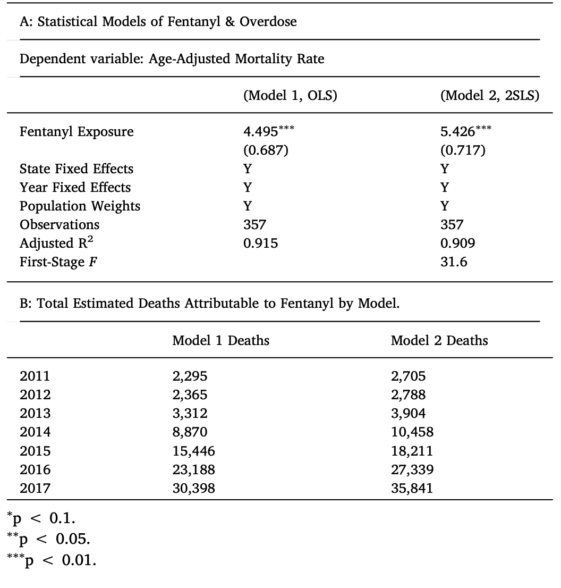

```{r setup, include=FALSE}
knitr::opts_chunk$set(echo = FALSE)

library(tidyverse)
library(data.table)
library(dplyr)
library(ggplot2)
library(lubridate)
library(lfe)
library(stargazer)
library(geofacet)
library(gtable)
library(kableExtra)
```

### Abstract

|  Zoorob (2019) shows that geography and fentanyl exposure explain much of the variation in increased overdose mortality rates between 2011 and 2017. I successfully replicated much of Zoorob's results, but I found discrepancies in the fentanyl exposure coefficients and the total death estimates for each model. My replication finds that the total death estimates are approximately 13% and 16% larger for each model and that the regression coefficients on fentanyl are slightly larger than those published. In addition to replicating Zoorob’s work, this paper provides a Rubin causal model table to better understand the model framework, focusing on explaining the ordinary least-squares model. Next, the bulk of the extension investigates alternative definitions of fentanyl exposure while keeping all of Zoorob’s other modeling choices the same. The original paper's definition of fentanyl exposure explains more variation in age-adjusted mortality rates than those proposed in the extension. This finding is important because many different methods of defining fentanyl exposure exist, however, the proposed alternative definitions in this extension do not appear to improve Zoorob's model.

### Introduction

|z    Fentanyl, a synthetic opioid 100 times more potent than morphine, is responsible for as much as two-thirds of the 46,802 overdose deaths in the United States in 2018 (@fentanyl). However, the opioid epidemic does not affect the country equally, as eastern and northeastern states experience more overdose deaths and drug seizures than states west of the Mississippi River (@Paper). Zoorob uses NFLIS forensic drug seizure data and age-adjusted mortality rate data^[Zoorob obtained the data used for his analysis through a Freedom of Information Act request. The data consist of state test results for drug seizures between 2011 and 2016, which he filters for test results containing fentanyl. Zoorob also uses age-adjusted mortality data from the National Center for Health Statistics. All the data used contain state and year information, and he uses state-annual populations to calculate mortality rates relative to a state's population in a particular year. The data and code that Zoorob used in his paper are available on the [Harvard Dataverse](https://doi.org/10.7910/DVN/8FWVFK)] from state-years between 2011 and 2017 to estimate fentanyl overdose mortality rates in two models: an ordinary least-squares model and a two-stage least-squares model. Zoorob finds that longitude is highly predictive of fentanyl exposure and uses longitude as the instrumental variable in his second model. Zoorob estimates the causal effect of fentanyl exposure on mortality rates to be about 4.5 and 5.4 for each model respectively, interpreted as the difference in the effect of fentanyl exposure between two state-years that differ from each other by one standard deviation. Zoorob also provides estimates of mortality deaths for each year, which are broadly consistent with official mortality statistics. 

|    Each of the models predicts overdose mortality as a function of a variable he calls fentanyl exposure. Zoorob defines fentanyl exposure by taking into account the state, year, an error term, and the natural logarithm of the number of seizure tests containing fentanyl (plus 1 to avoid an undefined logarithm of zero). Zoorob also divides by a state's population to generate a measure that allows comparisons across different states: 

\begin{center}

$Fentanyl_{ij} = \log{(\frac{S_{ij}}{P_{ij}} + 1)}$

\end{center}

|    Model 1 below is an ordinary least squares equation where $\alpha_{i}$ is state $i$ and $\eta_{j}$ is year $j$ The standard errors are two-way clustered by state and year and include population weights (@Paper).

\begin{center}

$Overdose_{ij} = \alpha_{i} + \eta_{j} + \beta_{1}Fentanyl_{ij} + \epsilon_{ij}$

\end{center}

The second model uses a two-stage least squares regression with longitude as the instrument variable:

\begin{center}

$\widehat{Fentanyl_{ij}} = \alpha_{i} + \eta_{j} + \beta_{1}(Longitude_{i}\cdot Year_{j}) + \epsilon_{ij}Overdose_{ij} = \alpha_{i} + \eta_{j} + \beta_{2}\widehat{Fentanyl_{ij}} + \epsilon_{ij}$

\end{center}

|    Findings in the paper show that much of the variation in the increased overdose mortality rates is explained by fentanyl exposure, getting stronger over time. Zoorob's analysis of police fentanyl seizures sheds light on the illegal drug supply and drug environments in the United States, showing that illicitly manufactured fentanyl contributed to the worsening overdose crisis. Zoorob determines that the drug supply is shaping the epicenter of the overdose crisis, for the epicenter shifted towards the eastern U.S., and states east of the Mississippi River tend to have greater fentanyl exposure and sharper increases in overdose deaths than states west of the Mississippi River. 

|    To conduct my replication, I used R ^[More information on this project can be found on my Github repository.^[[Github repository](https://github.com/alicrump/Fentanyl_Replication_Project)]](@R). I successfully replicated all of Zoorob's figures and one of the fentanyl exposure regression tables (Table 1); however, I was unable to replicate Table 2. The replicated total death estimates are approximately 13% and 16% larger for each model and the regression coefficients on fentanyl exposure are slightly larger than those published. The extension of the project proceeds with the model and regressions used in the corrected table.

|    The goals of this extension are to better understand Zoorob's models and to see if alternate definitions of fentanyl exposure could improve the models. The 'Rubin Table' frames the paper, which uses topics not covered in the scope of this course, in a context any reader familiar with statistical regressions will understand. The reasoning behind the second facet of the extension is that not just one definition of fentanyl exposure exists; one could apply seizure data to quantify a state's drug environment using other methods. Using three alternative definitions that seem reasonable, I conduct Zoorob's same analyses. He incorporates population weights in his regression analyses, so I examine a definition that does not use the state populations. I also test other plausible definitions that perform log transformations before dividing by state populations.

|    The back-of-the-envelope calculations from two of the alternative definitions are wildly unrealistic, estimating nearly a quarter of a million deaths up to as many as half a million deaths due to fentanyl between 2011 and 2017. Fentanyl only represents a portion of synthetic opioid deaths; even if fentanyl accounted for every single overdose death, official mortality statistics report 360,242 total overdose deaths, making these larger estimates impossible (@databrief). In contrast, the other definition used in the extension estimates total deaths approximately 80% smaller and 53% than Zoorob's models, respectively. Since official fentanyl overdose death numbers remain unknown, these estimates are not impossible, however, they are likely too extreme. Consistent with these extreme estimates, comparing R^2^ values for each of the models strongly suggests that Zoorob's method for measuring fentanyl exposure explains more variation in mortality rates than the alternate definitions of fentanyl exposure and that his method is more feasible. 

### Literature Review


|    The number of drug overdose deaths in the United States has rapidly increased since 2014. However, the opioid epidemic did not affect all regions of the U.S. equally; according to the CDC, almost all states west of the Mississippi River did not see an increase while those to the east did. Similar work to Zoorob's by Rigg et al. (2018) investigates the role of geography in opioid-related mortalities. Rigg et al. find that the opioid epidemic in the United States is not disproportionately rural and that the epidemic varies greatly across different rural areas (@Rigg). Also, research by Barocas et al. on the effect of opioid use among patients with endocarditis also cites Zoorob's work. Barocas et al. find a decreased risk of overdose associated with the West and South compared to the Northeast, consistent with Zoorob's conclusions (@endocarditis). Other authors' claims are consistent with Zoorobs; for example, research by Pearce et. al (2020) and Gladden et al. (2019) cite Zoorob's claim that the drug supply is contributing to the overdose crisis in their work (@Pearce)(@gladden). However, other work such as that of Dasgupta et. al (2018) argues social and economic factors play a role in one's susceptibility to opioid addiction and overdose, whereas Zoorob claims that the geographical patterns point to drug supply also playing a primary role in the epidemic. Surprisingly, drug overdose deaths decreased in 2018 by 4.6% from 2017 in the United States, however, fentanyl deaths continued to rise (@CDC)(@NYT). The amount of unknowns and variation in the opioid epidemic coupled with this unexpected change in 2018 shows that more testing, data, and further work are required to better understand the overdose crisis and the impact of synthetic opioids like fentanyl. 


```{r read in data, cache=TRUE}
## Read in data from data.prep file.

fent2017nflis <- read_rds("data/fent2017nflis.rds")
FOIA11_16 <- read_rds("data/FOIA11_16.rds")
FOIA11_16_State <- read_rds("data/FOIA11_16_State.rds")
heroin <- read_rds("data/heroin.rds")
latlon <- read_rds("data/latlon.rds")
overdose <- read_rds("data/overdose.rds")
poison_multiple <- read_rds("data/poison_multiple.rds")

```

```{r zoorob}
# Original code from Zoorob. Filtering for tests containing fentanyl.
# Calculating sums of fentanyl tests and new time variables.
# Counting reports containing fentanyl and caculating proportions.

d = unique(c(
  unique(FOIA11_16$subst1)[grep("fentanyl|Fentanyl|FENTANYL",
                            unique(FOIA11_16$subst1))],
    unique(FOIA11_16$subst2)[grep("fentanyl|Fentanyl|FENTANYL",
                             unique(FOIA11_16$subst2))], "U-47700"
    ))
h_string = c("Heroin", "heroin", "HEROIN")
d_h = c(d, "Heroin", "heroin", "HEROIN")


FOIA11_16$fent = as.numeric(rowSums(`dim<-`(as.matrix(FOIA11_16) %in% d, dim(FOIA11_16))) >= 1)
FOIA11_16$heroin = as.numeric(rowSums(`dim<-`(as.matrix(FOIA11_16) %in% c("Heroin"), dim(FOIA11_16))) >= 1)
FOIA11_16$date = mdy(FOIA11_16$submit_date)
FOIA11_16$year = year(FOIA11_16$date)

fentstateyear = FOIA11_16 %>%
  group_by(state, year) %>%
  summarize(any = n(), propfent = mean(fent),
            sumfent = sum(fent),sumheroin = sum(heroin))

# other states
FOIA11_16_State$fent = as.numeric(rowSums(`dim<-`(as.matrix(FOIA11_16_State) %in% d, dim(FOIA11_16_State))) >= 1)
FOIA11_16_State$heroin = as.numeric(rowSums(`dim<-`(as.matrix(FOIA11_16_State) %in% c("Heroin"), dim(FOIA11_16_State))) >= 1)
#FOIA11_16_State$date = mdy(FOIA11_16_State$SubmitD1ate)
FOIA11_16_State$year = as.numeric(FOIA11_16_State$case_received_year)

fentstateyear2 = FOIA11_16_State %>% 
  group_by(state, year) %>% 
  summarize(any = sum(count_of_reported_result),
            propfent = mean(fent*count_of_reported_result),
            sumfent = sum(fent*count_of_reported_result),
            sumheroin = sum(heroin*count_of_reported_result))

overdose$ST = state.abb[match(overdose$state,state.name)]
overdose[is.na(overdose$ST), "ST"] = "DC"
overdose$age_adjusted_rate = NULL
```


```{r zoorob code, include = FALSE, echo = FALSE}
# Original code from Zoorob. Summarizing the fentanyl test sums
# and combining the 2011-2016 data with the 2017 nflis data.

############### PLOTS
############ FIGURE 1

# fentyear
fentyear = fentstateyear %>% 
  group_by(year) %>% 
  summarize(sumfent = sum(sumfent))

### incorporate fentanyl from 2017
fent2017nflis$ST = state.abb[match(fent2017nflis$state,state.name)]
fent2017nflis$year = 2017
fent2017nflis[is.na(fent2017nflis$ST), "ST"] = "DC"
#

fentyear = rbind(fentyear, c(2017, sum(fent2017nflis$allfent)))
ggplot(fentyear, aes(factor(year), sumfent/1000, fill="Black")) + 
  geom_col(fill="Black") + 
  xlab("") +
  ylab("Fentanyl Test Reports (Thousands) \n") + 
  geom_text(aes(label=sumfent),hjust=0.5, vjust=-0.5, size=6) +
  theme_classic() +  
  theme(legend.position="", axis.text=element_text(size=14), axis.title.y=element_text(size=14))


### incorporate heroin from 2017
heroin$ST = state.abb[match(heroin$state,state.name)]
heroin$year = 2017
heroin[is.na(heroin$ST), "ST"] = "DC"

############# END FIGURE 1
```


```{r}
# Original code from Zoorob. Essentially merging all data into one tibble which
# includes fentanyl test data, age-adjusted mortality data, longitude and latitude 
# data. Calculates fentanyl exposure and other values like fentanyl tests per 
# capita. Designates states that are east of the Mississippi and west.

## geo facet - fent count year

fentstateyear_m = rbind(fentstateyear, fentstateyear2)
fentstateyear_m = fentstateyear_m %>% 
  group_by(state, year) %>% 
  summarize(sumfent = sum(sumfent),
            any = sum(any), 
            sumheroin=sum(sumheroin))

fentstateyear_m$propfent = fentstateyear_m$sumfent/fentstateyear_m$any

###
# get 2017
d17b = fent2017nflis[,c("ST", "year", "allfent")]
colnames(d17b)[3] = "sumfent"
d17b$any = NA
d17b = merge(d17b, heroin[,2:4])
colnames(d17b)[1] = "state"
colnames(d17b)[5] = "sumheroin"
d17b$propfent = NA


fentstateyear_m = rbind(data.frame(fentstateyear_m), d17b)

####################### clean up; end drug seizures processing
presod_f = fentstateyear_m[fentstateyear_m$state != "PR",]
presod_f$logfent = log(presod_f$sumfent+1)

##

############ merge  od with seizures
################## GET state year POP
poison_multiple$ST = state.abb[match(poison_multiple$state,state.name)]
poison_multiple[is.na(poison_multiple$ST), "ST"] = "DC"

presod_f = merge(presod_f, poison_multiple, by.x=c("state", "year"), by.y = c("ST", "year"))
colnames(presod_f)[1]="ST"
colnames(presod_f)[8] = "state"

########## GET LAT LON
presod_f = merge(presod_f, latlon)

###########
presod_f$fentcapita = presod_f$sumfent/presod_f$population*100000
# take log of seizures per capita
presod_f$fent_r = log(presod_f$fentcapita+1)
presod_f$perfent = presod_f$propfent*100
#######

#### TGROUP
#presod_f$tgroup = as.numeric(presod_f$longitude >= -90)
presod_f$tgroup = as.numeric(presod_f$longitude>-89.978027)
presod_f$tg2 = "West of MS River"
presod_f[presod_f$tgroup==1, "tg2"] = "East of MS River"
####

#### create lagged dvs for mortality rate in 2013 and mortality rate in 2011 
lagdv = presod_f[presod_f$year==2013, c("state", "age_adjusted_rate")]
colnames(lagdv) = c("state", "MORT_2013")
presod_f = merge(presod_f, lagdv)

lagdv = presod_f[presod_f$year==2011, c("state", "age_adjusted_rate")]
colnames(lagdv) = c("state", "MORT_2011")
presod_f = merge(presod_f, lagdv, all.x=TRUE, all.y=FALSE)

# create first difference style variables
presod_f$MORT_DIFF_11 = presod_f$age_adjusted_rate - presod_f$MORT_2011
# robustness/placebo
presod_f$MORT_DIFF_13 = presod_f$age_adjusted_rate - presod_f$MORT_2013

# prop heroin & heroin per capita
presod_f$propheroin = presod_f$sumheroin/presod_f$any
presod_f$heroincapita = presod_f$sumheroin/presod_f$population*100000
presod_f$heroin_r = log(presod_f$heroincapita+1)
presod_f$perheroin = presod_f$propheroin*100
```

### Replication  

|    The replication was partially successful. I successfully replicated Figures 1, 2, 3, 4, and Table 1 from the paper as well as figures from the appendix. As an example, Figure 1 is shown in the appendix. However, I was unable to replicate the results from Table 2, which include the parameters of the statistical models for overdose and fentanyl exposure for both the least-squares model (Model 1) and the second stage of a two-stage least squares model (Model 2). The results for table 2 from the original paper and my replication are shown below:

```{r, fig.cap="Zoorob (2019) Table 2", fig.align='center', dpi = 300, comment=NA}
# Including the screenshot using bookdown.


```


|    Zoorob's Model 1 estimates 85,874 total overdose deaths, while my replication estimates 96,969, approximately 13% higher. Likewise, for Model 2, his estimates total to 101,246, whereas mine total to 117,079, nearly 16% higher. The author confirmed slightly different models likely provided the published estimates than the ones included in the replication materials. In addition to the higher death estimates, my estimates for the coefficient on fentanyl exposure are slightly higher than Zoorob's for both models, which might explain why my estimated deaths are also higher. My estimates are shown below.


```{r tables 2a 2b, echo=FALSE, include=FALSE}
# Zoorob code for table 2a and 2b.

### IV AND MARGINALS
minst1 = felm(age_adjusted_rate ~ 1 | ST+year | (fent_r~longitude:year) | ST+year, 
              data=presod_f, weights=presod_f$population)
presod_f$fenteffectiv = presod_f$fent_r*summary(minst1)$coefficients[1]

## first stage F
summary(minst1$stage1)$iv1fstat["F"]
##

minst2 = felm(age_adjusted_rate ~ fent_r | ST+year | 0 | ST+year, 
              data=presod_f, weights=presod_f$population)
presod_f$fenteffect = presod_f$fent_r*summary(minst2)$coefficients[1]
```

```{r begin table 2 original, results='asis', fig.pos="H", fig.cap="Corrected Table 2 results. The OLS Model 1 is represented by fentr and the 2SLS Model 2 by fent_r(fit).", comment=NA}
#################################### TABLE 2
stargazer(minst2, minst1, type = 'latex', header = FALSE)

# save coefs
ols_coef = summary(minst2)$coefficients[1]
iv_coef = summary(minst1)$coefficients[1]

### estimate deaths
estdeath = function(dat, year, beta=ols_coef) {
  sum(beta*(dat[dat[,"year"]==year, "fent_r"])*(dat[dat[,"year"]==year,"population"]/100000))
}

# marginal effects df
meff = data.frame(cbind(
  rbind(               mean(presod_f[presod_f$year==2011,"fenteffect"]),
                       mean(presod_f[presod_f$year==2012,"fenteffect"]),
                       mean(presod_f[presod_f$year==2013,"fenteffect"]),
                       mean(presod_f[presod_f$year==2014,"fenteffect"]),
                       mean(presod_f[presod_f$year==2015,"fenteffect"]),
                       mean(presod_f[presod_f$year==2016,"fenteffect"]),
                       mean(presod_f[presod_f$year==2017,"fenteffect"])),
  rbind(mean(presod_f[presod_f$year==2011,"fenteffectiv"]),
        mean(presod_f[presod_f$year==2012,"fenteffectiv"]),
        mean(presod_f[presod_f$year==2013,"fenteffectiv"]),
        mean(presod_f[presod_f$year==2014,"fenteffectiv"]),
        mean(presod_f[presod_f$Ysear==2015,"fenteffectiv"]),
        mean(presod_f[presod_f$year==2016,"fenteffectiv"]),
        mean(presod_f[presod_f$year==2017,"fenteffectiv"])),
  rbind(estdeath(presod_f, 2011),
        estdeath(presod_f, 2012),
        estdeath(presod_f, 2013),
        estdeath(presod_f, 2014),
        estdeath(presod_f, 2015),
        estdeath(presod_f, 2016),
        estdeath(presod_f, 2017)),
  rbind(estdeath(presod_f, 2011, iv_coef),
        estdeath(presod_f, 2012, iv_coef),
        estdeath(presod_f, 2013, iv_coef),
        estdeath(presod_f, 2014, iv_coef),
        estdeath(presod_f, 2015, iv_coef),
        estdeath(presod_f, 2016, iv_coef),
        estdeath(presod_f, 2017, iv_coef))),
  row.names = c(2011:2017))
colnames(meff) = c("OLS", "2SLS", "Model 1 Deaths", "Model 2 Deaths")

# xtable::xtable(meff)
xtable::xtable(round(meff[,3:4]), digits=0)
options(table.comment = FALSE)
```


```{r table a1 appendix, results='asis', include=FALSE, echo=FALSE}
################################## TABLE 2 ROBUSTNESS CHECK (omitting Alaska and Hawaii
minst3 = felm(age_adjusted_rate ~ 1 | ST+year| (fent_r~longitude:year) | ST+year, 
              data=presod_f[!(presod_f$state %in% c("Alaska", "Hawaii")),],
              weights=presod_f[!(presod_f$state %in% c("Alaska", "Hawaii")),]$population)
minst4 = felm(age_adjusted_rate ~ fent_r | ST+year | 0 | ST+year, 
              data=presod_f[!(presod_f$state %in% c("Alaska", "Hawaii")),],
              weights=presod_f[!(presod_f$state %in% c("Alaska", "Hawaii")),]$population)

stargazer(minst4, minst3, type = 'latex', header = FALSE)
```

```{r longitude r2, echo=FALSE, include=FALSE}
############################## TABLE 1 and correlates of fent seizures per capita

### LONGITUDE & FENT
for(y in sort(unique(presod_f$year))) {
  m = lm(fent_r~longitude, data=presod_f[presod_f$year==y,])
  #print(summary(m)$coefficients[2,])
  print(paste(y, ": ", summary(m)$r.squared, sep=""))
  
  m2 = lm(fent_r~longitude, data=presod_f[presod_f$year==y & !(presod_f$ST %in% c("AK", "HI")),])
  print(paste(y, ": (NO Hawaii/Alaska) ", summary(m2)$r.squared, sep=""))
}
```

```{r latitude r2, echo=FALSE, include=FALSE}
### LAT
for(y in sort(unique(presod_f$year))) {
  m = lm(fent_r~latitude, data=presod_f[presod_f$year==y,])
  #print(summary(m)$coefficients[2,])
  print(paste(y, ": ", summary(m)$r.squared, sep=""))
  
  m2 = lm(fent_r~latitude, data=presod_f[presod_f$year==y & !(presod_f$ST %in% c("AK", "HI")),])
  print(paste(y, ": (NO Hawaii/Alaska) ", summary(m2)$r.squared, sep=""))
}
```


```{r mortality 2013 r2, echo=FALSE, include=FALSE}
## Mortality 2013
for(y in sort(unique(presod_f$year))) {
  m = lm(fent_r~MORT_2013, data=presod_f[presod_f$year==y,])
  #print(summary(m)$coefficients[2,])
  print(paste(y, ": ", summary(m)$r.squared, sep=""))
  
  m2 = lm(fent_r~MORT_2013, data=presod_f[presod_f$year==y & !(presod_f$ST %in% c("AK", "HI")),])
  print(paste(y, ": (NO Hawaii/Alaska) ", summary(m2)$r.squared, sep=""))
}
```


```{r table 1, results='asis', fig.pos="H", fig.cap="Table 1", include=FALSE, echo=FALSE}
################################## TABLE 1

############ FENTANYL EXPOSURE 2017
stargazer(lm(fent_r~longitude+latitude+MORT_2013, data=presod_f[presod_f$year==2013,]), 
          lm(fent_r~longitude+latitude+MORT_2013, data=presod_f[presod_f$year==2014,]), 
          lm(fent_r~longitude+latitude+MORT_2013, data=presod_f[presod_f$year==2015,]), 
          lm(fent_r~longitude+latitude+MORT_2013, data=presod_f[presod_f$year==2016,]), 
          lm(fent_r~longitude+latitude+MORT_2013, data=presod_f[presod_f$year==2017,]), 
          type = 'latex', 
          header = FALSE)  


################################## END TABLE 1
```


### Extension  

|    For my extension, I started by understanding the model using the framework of potential outcomes. Unlike more straightforward Rubin causal models with binary treatments, fentanyl exposure can theoretically take on any positive value. In the Rubin Causal Table below, the units are state-years for every state in the U.S. and for every year from 2011 to 2017. Fentanyl exposure represents the state's fentanyl exposure measured using seizure and population data. The table arbitrarily looks at the interval of fentanyl exposure from 2.0 to 2.6 for simplicity, but theoretically fentanyl exposure ranges from 0 to infinity. The values in the table for a particular state, year, and fentanyl exposure represent the overdose mortality rate in that state and year. Every state-year can only experience one level of fentanyl exposure, the fundamental problem of causal inference. Therefore, for every other fentanyl exposure level the state did not experience, the mortality rate is represented by a question mark; a state-year cannot experience more than one level of fentanyl exposure, so those mortality rates are unobservable unknown values. One works around this problem by using other states' mortality rates to fill in the question marks. 

\newpage

```{r rubin, fig.align='center',fig.height=20, fig.width=14, fig.pos="H"}
rubin <- tibble(
  Unit = c("Alabama","Alaska","Arizona","Arkansas","...","Alabama","...","Wyoming"),
  Year = c(2011,2011,2011,2011,"...",2012,"...",2017),
  f2.0 = c("?","?","1.3","?","...","?","...","?"),
  f2.1 = c("?","?","?","?","...","?","...","2.0"),
  f2.2 = c("?","?","?","3.1","...","?","...","?"),
  f2.3 = c("4.7","?","?","?","...","?","...","?"),
  f2.4 = c("?","?","?","?","...","?","...","?"),
  f2.5 = c("?","?","?","?","...","5.0","...","?"),
  f2.6 = c("?","2.9","?","?","...","?","...","?"),
  Causal_Effect = c("?","?","?","?","...","?","...","?")
)
rubin %>% 
gt::gt() %>% 
  gt::tab_header(
    title = "Rubin Causal Table",
    subtitle = "Estimating Overdose Mortality Rate Using Fentanyl Exposure"
  ) %>% 
  gt::tab_spanner(
    columns = vars(f2.0,f2.1,f2.2,f2.3,f2.4,f2.5,f2.6),
    label = "Fentanyl Exposure"
  ) %>% 
  gt::cols_label(
    f2.0 = "...2.0",
    f2.1 = "2.1",
    f2.2 = "2.2",
    f2.3 = "2.3",
    f2.4 = "2.4",
    f2.5 = "2.5",
    f2.6 = "2.6...",
    Causal_Effect = "Causal
    Effect"
  )
```
|    For example, suppose Alabama had a fentanyl exposure of 2.4 and a mortality rate of 4.7 deaths per 100,000 people in 2011. We cannot observe what the mortality rate would have been if fentanyl exposure had been 2.0, 2.1, 2.2, etc. Instead, we use mortality rates from other states with other fentanyl exposures to "fill in the blanks." Controlling for state populations and state-fixed effects, we might predict Alabama's 2.3 fentanyl exposure mortality rate in 2011 using Arkansas' 3.1 mortality rate. Continuing this process for every "question mark," we can compute the causal effect of a 1 unit change in fentanyl exposure. This visualization helps make these complex models more accessible.

|    In the second part of the extension, I explore how Zoorob uses the NFLIS state seizure data to define a measure of fentanyl exposure, $Fentanyl_{ij} = \log{(\frac{S_{ij}}{P_{ij}} + 1)}$. In essence, fentanyl exposure is a measure of a state's fentanyl drug supply in a particular year, controlling for population sizes and other fixed effects. He uses this measure of fentanyl exposure in his regression for both Models 1 and Model 2. Zoorob explains that he uses this measure to compare fentanyl exposure across states of highly variable populations, and that the plus 1 avoids and undefined logarithm of zero. However, the decision to transform the variables in this manner remains partially unclear. For my extension, I define fentanyl exposure several ways: 

1. $Fentanyl_{ij} = \log{(S_{ij} + 1)}$
2. $Fentanyl_{ij} = \frac{S_{ij}}{\log{(P_{ij} + 1)}} + 1$
3. $Fentanyl_{ij} = \frac{\log{({S_{ij}} + 1)}}{\log{(P_{ij})}}$

and run his same analyses. Zoorob's regression includes population weights and information already, so the first equation considers the choice of using $P_{ij}$ to define fentanyl exposure. The second definition only takes the log of population, since populations are large compared to the number of fentanyl drug seizures. The third definition is similar to Zoorob's but instead takes the log separately for both values, $S_{ij}$ and $P_{ij}$. The goal of this component of the extension is to see how different assumptions in defining fentanyl exposure affect the model results and to see if the original conclusions are robust to reasonable changes in the model.

### Tables

```{r}
presod_f <- presod_f %>% 
  mutate(ext1 = log(sumfent + 1)) %>% 
  mutate(ext2 = sumfent/log(population + 1)) %>% 
  mutate(ext3 = log(sumfent + 1)/log(population + 1))
```


```{r ext 1 table 1, results='asis', comment=NA, fig.pos="H"}
############ FENTANYL EXPOSURE 2017
stargazer(lm(ext1~longitude+latitude+MORT_2013, data=presod_f[presod_f$year==2013,]), 
          lm(ext1~longitude+latitude+MORT_2013, data=presod_f[presod_f$year==2014,]), 
          lm(ext1~longitude+latitude+MORT_2013, data=presod_f[presod_f$year==2015,]), 
          lm(ext1~longitude+latitude+MORT_2013, data=presod_f[presod_f$year==2016,]), 
          lm(ext1~longitude+latitude+MORT_2013, data=presod_f[presod_f$year==2017,]), 
          type = 'latex', 
          header = FALSE)  
```

```{r ext 1 table 2 models, echo=FALSE, include=FALSE, comment=NA, fig.pos="H"}
### IV AND MARGINALS
minst1 = felm(age_adjusted_rate ~ 1 | ST+year | (ext1~longitude:year) | ST+year, 
              data=presod_f, weights=presod_f$population)
presod_f$fenteffectiv = presod_f$ext1*summary(minst1)$coefficients[1]

## first stage F
summary(minst1$stage1)$iv1fstat["F"]
##

minst2 = felm(age_adjusted_rate ~ ext1 | ST+year | 0 | ST+year, 
              data=presod_f, weights=presod_f$population)
presod_f$fenteffect = presod_f$ext1*summary(minst2)$coefficients[1]
```

```{r ext 1 table 2a/b, results='asis', comment=NA, fig.pos="H"}
#################################### TABLE 2
stargazer(minst2, minst1, type = 'latex', header = FALSE)

# save coefs
ols_coef = summary(minst2)$coefficients[1]
iv_coef = summary(minst1)$coefficients[1]

### estimate deaths
estdeath = function(dat, year, beta=ols_coef) {
  sum(beta*(dat[dat[,"year"]==year, "ext1"])*(dat[dat[,"year"]==year,"population"]/100000))
}

# marginal effects df
meff = data.frame(cbind(
  rbind(               mean(presod_f[presod_f$year==2011,"fenteffect"]),
                       mean(presod_f[presod_f$year==2012,"fenteffect"]),
                       mean(presod_f[presod_f$year==2013,"fenteffect"]),
                       mean(presod_f[presod_f$year==2014,"fenteffect"]),
                       mean(presod_f[presod_f$year==2015,"fenteffect"]),
                       mean(presod_f[presod_f$year==2016,"fenteffect"]),
                       mean(presod_f[presod_f$year==2017,"fenteffect"])),
  rbind(mean(presod_f[presod_f$year==2011,"fenteffectiv"]),
        mean(presod_f[presod_f$year==2012,"fenteffectiv"]),
        mean(presod_f[presod_f$year==2013,"fenteffectiv"]),
        mean(presod_f[presod_f$year==2014,"fenteffectiv"]),
        mean(presod_f[presod_f$Ysear==2015,"fenteffectiv"]),
        mean(presod_f[presod_f$year==2016,"fenteffectiv"]),
        mean(presod_f[presod_f$year==2017,"fenteffectiv"])),
  rbind(estdeath(presod_f, 2011),
        estdeath(presod_f, 2012),
        estdeath(presod_f, 2013),
        estdeath(presod_f, 2014),
        estdeath(presod_f, 2015),
        estdeath(presod_f, 2016),
        estdeath(presod_f, 2017)),
  rbind(estdeath(presod_f, 2011, iv_coef),
        estdeath(presod_f, 2012, iv_coef),
        estdeath(presod_f, 2013, iv_coef),
        estdeath(presod_f, 2014, iv_coef),
        estdeath(presod_f, 2015, iv_coef),
        estdeath(presod_f, 2016, iv_coef),
        estdeath(presod_f, 2017, iv_coef))),
  row.names = c(2011:2017))
colnames(meff) = c("OLS", "2SLS", "Model 1 Deaths", "Model 2 Deaths")

# xtable::xtable(meff)
xtable::xtable(round(meff[,3:4]), digits=0)
## I added this to get rid of extra output
options(xtable.comment = FALSE)
```


### Conclusion

|    My ordinary least squares estimated fentanyl deaths from extensions 1 and 3, totaling to 234,037 and 238,812 respectively, are much larger than Zoorob's corrected estimates, totaling to 96,969. Zoorob's corrected 2016 estimate, 26,491 deaths, is also more consistent with the official mortality statistic of 19,400 than either of the extension estimates: 46,641, 5,732, and 47,610 respectively. Estimates from extensions 1 and 3 appear to be too high, and estimates from extension 2 appear to be too low to be consistent with official mortality statistics. 

|    Moreover, when comparing R^2^ values for each model, Zoorob's method of defining fentanyl exposure appears to explain more of the variation in mortality rate than any of the extensions. Zoorob's R^2^ for the OLS model is 0.915, whereas those of the extensions are 0.840, 0.883, and 0.846. 

\newpage

### Appendix  

```{r figure 1,fig.height=8, fig.width=12, dpi=300, fig.pos="H"}
############################## FIGURE 2
ggplot(presod_f, aes(x=year, 100*fentcapita, fill=tgroup)) + 
  geom_col() + 
  xlab("") +
  ylab("Fentanyl/Analogues per 100k \n") + 
  facet_geo(~state, scales="fixed") +
  theme_bw() + 
  theme(legend.position = "", plot.title = element_text(size=28), axis.text = element_text(size=7)) +
  labs(caption = "Source: National Forensic Laboratory Information System (NFLIS)") +
  ggtitle("\n Drug Seizures with Fentanyl (2011-2017) \n") 
# ggsave("Figures/Figure2/figure2_fentcapita_17.png", width=12, height=8, units="in", dpi=300)
```

##### Extension 2 

```{r ext2 table 1, results='asis', comment=NA, fig.pos="H"}
############ FENTANYL EXPOSURE 2017
stargazer(lm(ext2~longitude+latitude+MORT_2013, data=presod_f[presod_f$year==2013,]), 
          lm(ext2~longitude+latitude+MORT_2013, data=presod_f[presod_f$year==2014,]), 
          lm(ext2~longitude+latitude+MORT_2013, data=presod_f[presod_f$year==2015,]), 
          lm(ext2~longitude+latitude+MORT_2013, data=presod_f[presod_f$year==2016,]), 
          lm(ext2~longitude+latitude+MORT_2013, data=presod_f[presod_f$year==2017,]), 
          type = 'latex', 
          header = FALSE)  
```

```{r ext2 table 2 prep, echo=FALSE, include=FALSE, comment=NA,fig.pos="H"}
### IV AND MARGINALS
minst1 = felm(age_adjusted_rate ~ 1 | ST+year | (ext2~longitude:year) | ST+year, 
              data=presod_f, weights=presod_f$population)
presod_f$fenteffectiv = presod_f$ext2*summary(minst1)$coefficients[1]

## first stage F
summary(minst1$stage1)$iv1fstat["F"]
##

minst2 = felm(age_adjusted_rate ~ ext2 | ST+year | 0 | ST+year, 
              data=presod_f, weights=presod_f$population)
presod_f$fenteffect = presod_f$ext2*summary(minst2)$coefficients[1]
```

```{r ext2 table 2a/b, results='asis', comment=NA, fig.pos="H"}
#################################### TABLE 2
stargazer(minst2, minst1, type = 'latex', header = FALSE)

# save coefs
ols_coef = summary(minst2)$coefficients[1]
iv_coef = summary(minst1)$coefficients[1]

### estimate deaths
estdeath = function(dat, year, beta=ols_coef) {
  sum(beta*(dat[dat[,"year"]==year, "ext2"])*(dat[dat[,"year"]==year,"population"]/100000))
}

# marginal effects df
meff = data.frame(cbind(
  rbind(               mean(presod_f[presod_f$year==2011,"fenteffect"]),
                       mean(presod_f[presod_f$year==2012,"fenteffect"]),
                       mean(presod_f[presod_f$year==2013,"fenteffect"]),
                       mean(presod_f[presod_f$year==2014,"fenteffect"]),
                       mean(presod_f[presod_f$year==2015,"fenteffect"]),
                       mean(presod_f[presod_f$year==2016,"fenteffect"]),
                       mean(presod_f[presod_f$year==2017,"fenteffect"])),
  rbind(mean(presod_f[presod_f$year==2011,"fenteffectiv"]),
        mean(presod_f[presod_f$year==2012,"fenteffectiv"]),
        mean(presod_f[presod_f$year==2013,"fenteffectiv"]),
        mean(presod_f[presod_f$year==2014,"fenteffectiv"]),
        mean(presod_f[presod_f$Ysear==2015,"fenteffectiv"]),
        mean(presod_f[presod_f$year==2016,"fenteffectiv"]),
        mean(presod_f[presod_f$year==2017,"fenteffectiv"])),
  rbind(estdeath(presod_f, 2011),
        estdeath(presod_f, 2012),
        estdeath(presod_f, 2013),
        estdeath(presod_f, 2014),
        estdeath(presod_f, 2015),
        estdeath(presod_f, 2016),
        estdeath(presod_f, 2017)),
  rbind(estdeath(presod_f, 2011, iv_coef),
        estdeath(presod_f, 2012, iv_coef),
        estdeath(presod_f, 2013, iv_coef),
        estdeath(presod_f, 2014, iv_coef),
        estdeath(presod_f, 2015, iv_coef),
        estdeath(presod_f, 2016, iv_coef),
        estdeath(presod_f, 2017, iv_coef))),
  row.names = c(2011:2017))
colnames(meff) = c("OLS", "2SLS", "Model 1 Deaths", "Model 2 Deaths")

# xtable::xtable(meff)
xtable::xtable(round(meff[,3:4]), digits=0)
## I added this to get rid of extra output
options(xtable.comment = FALSE)
```

##### Extension 3 

```{r ext3 table1, results='asis', comment=NA, fig.pos="H"}
############ FENTANYL EXPOSURE 2017
stargazer(lm(ext3~longitude+latitude+MORT_2013, data=presod_f[presod_f$year==2013,]), 
          lm(ext3~longitude+latitude+MORT_2013, data=presod_f[presod_f$year==2014,]), 
          lm(ext3~longitude+latitude+MORT_2013, data=presod_f[presod_f$year==2015,]), 
          lm(ext3~longitude+latitude+MORT_2013, data=presod_f[presod_f$year==2016,]), 
          lm(ext3~longitude+latitude+MORT_2013, data=presod_f[presod_f$year==2017,]), 
          type = 'latex', 
          header = FALSE)  
```
```{r ext3 tables, echo=FALSE, include=FALSE}
### IV AND MARGINALS
minst1 = felm(age_adjusted_rate ~ 1 | ST+year | (ext3~longitude:year) | ST+year, 
              data=presod_f, weights=presod_f$population)
presod_f$fenteffectiv = presod_f$ext3*summary(minst1)$coefficients[1]

## first stage F
summary(minst1$stage1)$iv1fstat["F"]
##

minst2 = felm(age_adjusted_rate ~ ext3 | ST+year | 0 | ST+year, 
              data=presod_f, weights=presod_f$population)
presod_f$fenteffect = presod_f$ext3*summary(minst2)$coefficients[1]
```

```{r ext3 table 2, results='asis', comment=NA, fig.pos="H"}
#################################### TABLE 2
stargazer(minst2, minst1, type = 'latex', header = FALSE)

# save coefs
ols_coef = summary(minst2)$coefficients[1]
iv_coef = summary(minst1)$coefficients[1]

### estimate deaths
estdeath = function(dat, year, beta=ols_coef) {
  sum(beta*(dat[dat[,"year"]==year, "ext3"])*(dat[dat[,"year"]==year,"population"]/100000))
}

# marginal effects df
meff = data.frame(cbind(
  rbind(               mean(presod_f[presod_f$year==2011,"fenteffect"]),
                       mean(presod_f[presod_f$year==2012,"fenteffect"]),
                       mean(presod_f[presod_f$year==2013,"fenteffect"]),
                       mean(presod_f[presod_f$year==2014,"fenteffect"]),
                       mean(presod_f[presod_f$year==2015,"fenteffect"]),
                       mean(presod_f[presod_f$year==2016,"fenteffect"]),
                       mean(presod_f[presod_f$year==2017,"fenteffect"])),
  rbind(mean(presod_f[presod_f$year==2011,"fenteffectiv"]),
        mean(presod_f[presod_f$year==2012,"fenteffectiv"]),
        mean(presod_f[presod_f$year==2013,"fenteffectiv"]),
        mean(presod_f[presod_f$year==2014,"fenteffectiv"]),
        mean(presod_f[presod_f$Ysear==2015,"fenteffectiv"]),
        mean(presod_f[presod_f$year==2016,"fenteffectiv"]),
        mean(presod_f[presod_f$year==2017,"fenteffectiv"])),
  rbind(estdeath(presod_f, 2011),
        estdeath(presod_f, 2012),
        estdeath(presod_f, 2013),
        estdeath(presod_f, 2014),
        estdeath(presod_f, 2015),
        estdeath(presod_f, 2016),
        estdeath(presod_f, 2017)),
  rbind(estdeath(presod_f, 2011, iv_coef),
        estdeath(presod_f, 2012, iv_coef),
        estdeath(presod_f, 2013, iv_coef),
        estdeath(presod_f, 2014, iv_coef),
        estdeath(presod_f, 2015, iv_coef),
        estdeath(presod_f, 2016, iv_coef),
        estdeath(presod_f, 2017, iv_coef))),
  row.names = c(2011:2017))
colnames(meff) = c("OLS", "2SLS", "Model 1 Deaths", "Model 2 Deaths")

# xtable::xtable(meff)
xtable::xtable(round(meff[,3:4]), digits=0)
## I added this to get rid of extra output
options(xtable.comment = FALSE)
```

\newpage
\newpage
\pagebreak

### References
